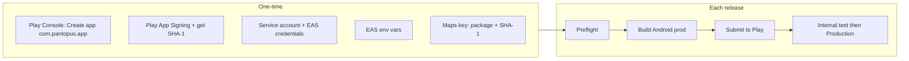

# Android Release Readiness and Build/Release Guide

This guide covers whether the Pantopus mobile app is ready for Android release and gives step-by-step instructions to build and release on Android (Google Play Console, internal testing, and production).

## Part 1: Is the repo ready for Android release?

### What's already in place

- **Expo / EAS**
  - `frontend/apps/mobile/app.json`: Android `adaptiveIcon` (foreground + background), app icon and splash. No `package` in app.json — it is set in `app.config.js`.
  - `frontend/apps/mobile/app.config.js`: Env-based `ANDROID_VERSION_CODE`, production config, Google Maps API key wiring (`android.config.googleMaps.apiKey`), `EAS_PROJECT_ID` from env or base config. **Package name**: `com.pantopus.app`.
  - `frontend/apps/mobile/eas.json`: Build profiles `development`, `preview`, `production` with Android (`buildType: "app-bundle"` for preview/production; development uses `apk`). `autoIncrement: true` for production. Submit profile under `submit.production.android` with `track: "internal"` and `releaseStatus: "draft"` (you can change track for production).
  - `frontend/apps/mobile/package.json`: Scripts `build:android:preview`, `build:android:prod`, `submit:android:prod`; Expo SDK ~54, React Native 0.81.5.
  - EAS project id is set in `app.json` → `extra.eas.projectId`.
  - `frontend/apps/mobile/scripts/release-preflight.mjs`: Validates production config (bundle ID, Android package `com.pantopus.app`, Android versionCode, EAS project id, iOS checks, plugins, eas.json profiles including Android, no placeholders), runs `expo install --check`, `expo-doctor`, and `tsc --noEmit`.
  - `frontend/apps/mobile/README.release.md`: One-time setup, EAS env vars, preflight, build/submit commands for both Android and iOS.
  - Assets: `frontend/apps/mobile/assets/icon.png` and `assets/adaptive-icon.png` present.
  - API config: `frontend/apps/mobile/src/config/api.ts` requires `EXPO_PUBLIC_API_URL` with `https` in production and uses `expo-secure-store` for tokens.
  - Maps: `docs/maps-key-restrictions.md` documents restricting Google Maps key to Android package `com.pantopus.app` and SHA-1 fingerprints (debug + Play App Signing).

### Gaps / things to do before release

| Item | Notes |
|------|--------|
| **EAS environment variables** | Not in repo (by design). Set in EAS dashboard for `preview` and `production`: `APP_ENV`, `EXPO_PUBLIC_API_URL`, `EXPO_PUBLIC_STRIPE_PUBLISHABLE_KEY`, `EXPO_PUBLIC_GOOGLE_MAPS_API_KEY`. For Android, use a key restricted to package `com.pantopus.app` + SHA-1 (see below). |
| **Google Play Console** | One-time: Create a developer account ($25 one-time fee). Create an app with package name **com.pantopus.app**. Complete store listing, content rating, privacy policy, and target audience. |
| **Google Play service account (for EAS Submit)** | One-time: Create a service account in Google Cloud, enable Google Play Android Developer API, grant the service account access in Play Console (API access), download JSON key, then add it in EAS (Dashboard → Project → Credentials → Android → Google Service Account Key). Required for non-interactive `eas submit`. |
| **Google Maps API key (Android)** | In Google Cloud Console, restrict the key to **Android apps** with package name `com.pantopus.app` and **SHA-1 fingerprints**: (1) EAS/Expo build keystore SHA-1 (from EAS credentials or first build), (2) Google Play App Signing key SHA-1 (from Play Console → Setup → App signing). See `docs/maps-key-restrictions.md`. |
| **CI** | `.github/workflows/ci.yml` runs mobile-checks and an Android export smoke test. No EAS Android build or submit in CI; add if you want automated builds. |

**Verdict:** The repo is **ready for Android release** once: (1) EAS env vars are set for production, (2) Google Play Console one-time setup is done (app with `com.pantopus.app`), (3) you add the Google Play service account key in EAS for submit, (4) you restrict the Google Maps key to Android package + SHA-1 (after you have the signing key SHA-1), and (5) you run the preflight script and fix any failures.

---

## Part 2: Step-by-step build and release on Android

### Prerequisites

- **Google Play Developer account** ($25 one-time).
- **Expo / EAS**: Node 18+, pnpm, EAS CLI (`pnpm dlx eas-cli` or `npm install -g eas-cli`).
- **Local**: From repo root, use **pnpm** only (no npm in this monorepo).

---

### Phase A: One-time Google Play and EAS setup

#### A1. Google Play Console – Developer account and app

1. Go to [Google Play Console](https://play.google.com/console) and sign in with a Google account.
2. Pay the **one-time $25 registration fee** and accept the developer agreement.
3. **Create an app**:
   - Click **Create app**.
   - App name: **Pantopus**. Default language, type (App or Game), and whether it’s free/paid.
4. Set the **application ID** to **com.pantopus.app** (must match `app.config.js`). In Play Console this is usually set when you create the app or in the app’s technical settings; ensure it is exactly `com.pantopus.app`.
5. Complete **required setup** (can be done over time, but needed before first release):
   - **Store listing**: Short and full description, screenshots (phone 7" and 10" if tablet), feature graphic, app icon, privacy policy URL.
   - **Content rating**: Complete the questionnaire and obtain a rating.
   - **Target audience**: Age groups.
   - **News app / COVID declarations**: Answer as applicable.
   - **Data safety**: Declare what data is collected and how it’s used.
   - **App access**: If the app is restricted (e.g. login required), provide test credentials for review.

#### A2. App signing (Google Play App Signing)

1. In Play Console → your app → **Setup** → **App signing**.
2. Choose **Continue with Google Play App Signing** (recommended). Google will hold the production key; you (or EAS) use an upload key.
3. For **EAS builds**, EAS can create and manage the upload keystore. On the first Android production build, EAS will prompt or use credentials you’ve configured. After the first build, in **Play Console → Setup → App signing** you’ll see the **App signing key certificate** (SHA-1). Copy this SHA-1 for Google Maps key restriction (see A4).

#### A3. Google Play service account (for EAS Submit)

To run `eas submit --platform android --profile production` without interactive prompts (e.g. in CI or scripts), add a Google Play service account and its JSON key to EAS.

1. **Google Cloud Console**
   - Go to [Google Cloud Console](https://console.cloud.google.com) and select (or create) a project.
   - Enable **Google Play Android Developer API**: [API Library → Android Publisher API](https://console.cloud.google.com/apis/library/androidpublisher.googleapis.com) → **Enable**.

2. **Create service account**
   - Go to [IAM & Admin → Service Accounts](https://console.cloud.google.com/iam-admin/serviceaccounts).
   - **Create Service Account**: name e.g. `eas-submit-pantopus`, create and continue.
   - **Create key**: Keys → Add key → Create new key → **JSON** → Create. Save the `.json` file securely and do **not** commit it to git.

3. **Grant access in Play Console**
   - Go to [Play Console](https://play.google.com/console) → **Setup** → **API access**.
   - **Link** the Google Cloud project if prompted.
   - **Invite new user** → enter the **service account email** (e.g. `eas-submit-pantopus@your-project.iam.gserviceaccount.com`).
   - Assign at least: **Release apps to production, exclude devices, and use Play App Signing** (or **Admin** for full access). Save.

4. **Add the key in EAS**
   - [Expo dashboard](https://expo.dev) → your project → **Credentials** → **Android**.
   - Under **Google Service Account Key**, upload the JSON key file (or paste contents). Alternatively use EAS CLI if your workflow supports it.

After this, `eas submit --platform android --profile production --latest` can submit without asking for credentials.

#### A4. EAS project and env vars

1. From repo root:
   ```bash
   pnpm --filter pantopus-mobile exec eas whoami
   ```
   Log in if needed. Project is already linked via `app.json` → `extra.eas.projectId`.

2. Confirm project:
   ```bash
   pnpm dlx eas-cli project:info
   ```
   (Run from repo root or from `frontend/apps/mobile`.)

3. Set **EAS environment variables** for **production** (and optionally **preview**):
   - `APP_ENV` = `production` (or `preview` for preview)
   - `EXPO_PUBLIC_API_URL` = `https://api.pantopus.com` (or your production API URL)
   - `EXPO_PUBLIC_STRIPE_PUBLISHABLE_KEY` = your Stripe **live** publishable key
   - `EXPO_PUBLIC_GOOGLE_MAPS_API_KEY` = Google Maps API key restricted to Android package `com.pantopus.app` and the relevant SHA-1 fingerprints (see below)

   Example (production):
   ```bash
   cd frontend/apps/mobile
   pnpm dlx eas-cli env:create --environment production --name APP_ENV --value production --force
   pnpm dlx eas-cli env:create --environment production --name EXPO_PUBLIC_API_URL --value "https://api.pantopus.com" --force
   pnpm dlx eas-cli env:create --environment production --name EXPO_PUBLIC_STRIPE_PUBLISHABLE_KEY --value "pk_live_..." --force
   pnpm dlx eas-cli env:create --environment production --name EXPO_PUBLIC_GOOGLE_MAPS_API_KEY --value "your_android_maps_key" --force
   ```

#### A5. Google Maps key restriction (Android)

1. In [Google Cloud Console → Credentials](https://console.cloud.google.com/apis/credentials), edit the key used for `EXPO_PUBLIC_GOOGLE_MAPS_API_KEY` (or create a dedicated Android key).
2. **Application restrictions** → **Android apps**.
3. Add:
   - **Package name**: `com.pantopus.app`
   - **SHA-1**:
     - From **EAS build keystore**: Expo dashboard → Project → Credentials → Android → view keystore fingerprint (or run a build and get it from EAS). Add this SHA-1.
     - From **Play Console**: Setup → App signing → **App signing key certificate** → SHA-1. Add this SHA-1.
4. **API restrictions**: Restrict to **Maps SDK for Android** (and any other APIs the app uses).
5. Save. Use this key value in EAS env `EXPO_PUBLIC_GOOGLE_MAPS_API_KEY` for Android builds.

See `docs/maps-key-restrictions.md` for the full checklist.

---

### Phase B: Preflight and build

#### B1. Install and preflight

1. From repo root:
   ```bash
   pnpm install
   ```
2. Run the release preflight (uses production-like config; set `EXPO_PUBLIC_API_URL` in the shell if needed for introspect):
   ```bash
   pnpm --filter pantopus-mobile run preflight:release
   ```
   Fix any reported errors.

#### B2. Optional: preview build (internal)

- Build:
  ```bash
  pnpm --filter pantopus-mobile run build:android:preview
  ```
- EAS will build in the cloud. Download the `.aab` (Android App Bundle) or use the build link for internal distribution.

#### B3. Production build

1. From repo root:
   ```bash
   pnpm --filter pantopus-mobile run build:android:prod
   ```
2. EAS uses the **production** profile: `APP_ENV=production`, `autoIncrement` for version code (and iOS build number when building both), output is an **app bundle** (`.aab`). Build runs on EAS servers; credentials (keystore) are managed by EAS.
3. Wait for the build to finish in the [Expo dashboard](https://expo.dev) or CLI. Note the build ID/URL.

---

### Phase C: Submit to Google Play

#### C1. Submit the build

1. From repo root:
   ```bash
   pnpm --filter pantopus-mobile run submit:android:prod
   ```
2. If you did not add a Google Play service account key in EAS, the CLI may prompt for credentials or a path to the AAB. With the service account key configured, use `--latest` to submit the latest production build:
   ```bash
   cd frontend/apps/mobile
   pnpm dlx eas-cli submit --platform android --profile production --latest
   ```
3. EAS uploads the `.aab` to Google Play according to `eas.json` → `submit.production.android` (default: `track: "internal"`, `releaseStatus: "draft"`). Change `track` to `"production"` (or `"beta"`) when you want to release to that track.

#### C2. Internal testing (recommended first)

1. In [Play Console](https://play.google.com/console) → your app → **Testing** → **Internal testing**.
2. Create a release and select the build you just submitted (or let the draft release use it).
3. Add **internal testers** (email list). Save and roll out.
4. Testers get the link to opt in and install from the Play Store.

#### C3. Production (or beta) release

1. When ready for production: in **Play Console** → **Release** → **Production** (or **Testing** → **Open testing** / **Closed testing** for beta).
2. Create a new release, upload or select the production AAB (if not already submitted to that track, run submit with the appropriate profile or change `eas.json` submit config to `track: "production"`).
3. Add **release notes**, complete any remaining checks (content rating, policy status, etc.).
4. **Review and roll out** → Start rollout to Production (or the chosen track).

---

### Phase D: After release

- **Updates**: Bump version in `app.json` (e.g. `version`) when you want a new store version. Use `ANDROID_VERSION_CODE` in EAS or rely on `autoIncrement` in the production profile so each build gets a higher version code.
- **Submit config**: To submit to **production** track by default, set in `frontend/apps/mobile/eas.json`:
  ```json
  "submit": {
    "production": {
      "android": {
        "track": "production",
        "releaseStatus": "draft"
      },
      ...
    }
  }
  ```
  You can still create a release as draft in Play Console and then roll out when ready.

---

### Flow summary



---

### Quick reference commands (from repo root)

| Step | Command |
|------|--------|
| Preflight | `pnpm --filter pantopus-mobile run preflight:release` |
| Android production build | `pnpm --filter pantopus-mobile run build:android:prod` |
| Submit to Google Play | `pnpm --filter pantopus-mobile run submit:android:prod` |

Optional: run EAS from the mobile app directory: `cd frontend/apps/mobile` then `pnpm dlx eas-cli build --platform android --profile production` and `pnpm dlx eas-cli submit --platform android --profile production --latest`.

---

### Optional: Submit profile for production track

To submit directly to the **production** track (still as draft in Play Console), set in `frontend/apps/mobile/eas.json`:

```json
"submit": {
  "production": {
    "android": {
      "track": "production",
      "releaseStatus": "draft"
    },
    ...
  }
}
```

Then each `submit:android:prod` uploads to the production track; you complete the release and rollout in Play Console.
