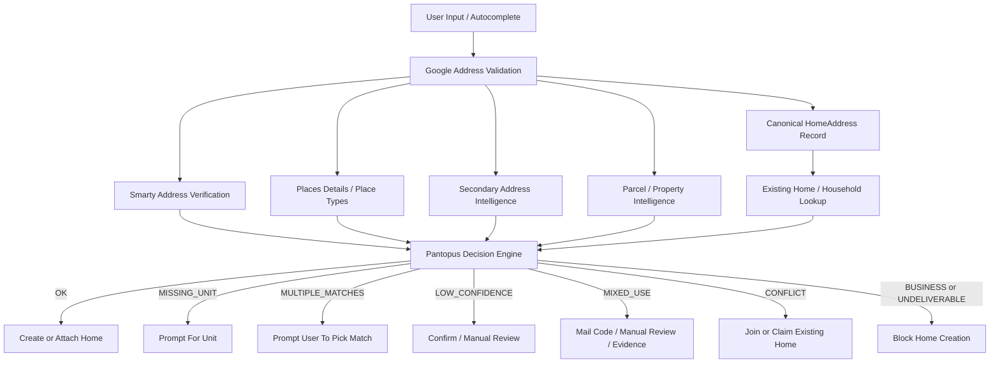

# Pantopus Home Address Verification Design

Status: Draft  
Date: 2026-04-02  
Scope: Home onboarding, home creation, existing-home claim, unit re-validation, business/institution blocking, step-up verification, provider integrations, observability, rollout

## 1. Executive Summary

Pantopus should not replace its current home-address verification system. It should build on top of the system already in the repo:

- canonical address identity via `address_id` and `address_hash`
- server-authoritative address validation routes
- deterministic verdicts such as `OK`, `MISSING_UNIT`, `BUSINESS`, `MIXED_USE`, `LOW_CONFIDENCE`, and `CONFLICT`
- existing-home conflict routing
- optional mail-based step-up verification

The gap is not the skeleton. The gap is the intelligence layer.

Today Pantopus has strong postal validation and decent heuristics, but it does not yet have a true provider-backed place and parcel classification layer. That is why it can still miss or ambiguously classify addresses such as:

- schools and universities
- stadiums, arenas, and event venues
- churches and other places of worship
- hospitals and medical campuses
- government buildings
- factories, warehouses, and corporate offices
- mixed-use retail-plus-residential buildings

The target design is a multi-layer verification pipeline:

1. Canonical address validation and normalization
2. Postal deliverability and residential/commercial checks
3. Place or POI classification
4. Parcel or property-intelligence enrichment
5. Unit intelligence for multi-unit addresses
6. Existing-home conflict detection
7. Deterministic decision engine
8. Step-up verification for ambiguous but potentially valid homes

Important constraint: no address system can guarantee 100% perfect classification in every case. The real target is:

- very low false negatives for obvious non-home addresses
- very low false positives for valid residential homes
- deterministic, explainable decisions
- a safe escalation path for ambiguous addresses

This design is US-first. International support should be treated as a separate phase with different provider choices and policy tuning.

## 2. Goals

### Product Goals

- Reject addresses that do not exist or are not deliverable.
- Reject synthetic or artificially created addresses when providers detect them.
- Reject non-home addresses such as shops, offices, schools, hospitals, stadiums, churches, factories, government buildings, and similar institutions.
- Detect missing apartment or unit numbers and prompt for correction.
- Prevent duplicate home creation when a home already exists on Pantopus.
- Preserve valid homes located on streets whose names contain words like `University`, `Church`, `School`, `Hospital`, or similar.
- Keep the backend as the authority. The client may assist but must not be trusted.
- Keep the current Pantopus verdict contract stable so existing UX does not need a full rewrite.

### Engineering Goals

- Minimize frontend churn by preserving current route contracts.
- Make vendor layers pluggable behind Pantopus-owned interfaces.
- Persist canonical verification data so retries and outages do not force re-verification.
- Support safe degraded behavior during provider outages.
- Make every decision explainable and auditable.

### Non-Goals

- Proving legal ownership of a home. That is a separate ownership or residency problem.
- Solving all global address formats in the first phase.
- Eliminating all manual review forever.
- Relying on a single vendor to answer every scenario perfectly.

## 3. Current Pantopus Foundation

Pantopus already has the right core shape:

- `backend/routes/addressValidation.js`
- `backend/routes/home.js`
- `backend/services/addressValidation/pipelineService.js`
- `backend/services/addressValidation/addressDecisionEngine.js`
- `backend/services/addressValidation/canonicalAddressService.js`
- `frontend/apps/mobile/src/components/homes/useHomeForm.ts`
- `frontend/apps/web/src/app/(app)/app/homes/new/page.tsx`

Current strengths:

- canonical `HomeAddress` records
- hash-based and `address_id`-based dedup
- deterministic address verdicts
- missing-unit detection
- existing-home conflict detection
- server-side home creation enforcement

Current weaknesses:

- no true provider-backed POI classification layer yet
- no true parcel or land-use layer yet
- institutional-address blocking still relies partly on heuristics
- mixed-use logic is conservative but not yet backed by property intelligence

Conclusion: build on top of the existing Pantopus pipeline. Do not restart from zero.

## 4. Problem Statement

Postal validation is necessary but not sufficient.

A school, hospital, church, arena, mall, office tower, or factory can have:

- a real street address
- valid USPS deliverability
- rooftop geocoding
- a non-missing unit or suite

That means a postal-only solution will still accept many non-home addresses unless Pantopus adds a separate classification layer that answers:

- what is this place
- what is this parcel used for
- does it contain residential units
- is it a mixed-use building

The system also has to handle the inverse problem:

- valid homes on `University Ave`
- valid homes on `Church St`
- residential condominiums near campuses or hospitals
- mixed-use buildings with homes above ground-floor retail

The design must therefore optimize for both:

- fraud and misuse prevention
- residential false-positive avoidance

## 5. Verification Principles

### 5.1 Server Is The Authority

All final verification and gating decisions happen on the backend. The client may:

- collect input
- show autocomplete
- display corrections and errors
- hold `address_id`

But the client must never be the trust boundary.

### 5.2 Canonicalize Once

Every successful validation creates or updates a canonical address record. All downstream flows should use that canonical record, not repeatedly reinterpret raw user input.

### 5.3 Separate Provider Signals From Pantopus Decisions

Providers return raw signals. Pantopus converts those signals into its own normalized internal model. Pantopus then makes the final product decision.

That separation is what keeps vendor lock-in manageable.

### 5.4 Risk-Based Escalation

Not every ambiguous address should be rejected. Some should be:

- corrected
- confirmed
- asked for a unit number
- routed to existing-home flow
- challenged with mail code or manual review

### 5.5 Deterministic And Explainable

Every verdict must have:

- status
- reasons
- contributing signals
- next action
- provider traceability

## 6. Scenario Coverage Matrix

| Scenario | Example | Target behavior | Primary signals |
| --- | --- | --- | --- |
| Fake or nonexistent address | made-up number on nonexistent street | Reject as `UNDELIVERABLE` | Google validation low quality, USPS DPV no match, low granularity, inferred or replaced components |
| Artificially created address | synthetic address patterns flagged by USPS/Google | Reject as `UNDELIVERABLE` or `SERVICE_ERROR_BLOCKED` | Google Address Validation or USPS synthetic-address indicators |
| Wrong but real address | typo or corrected street/city/ZIP | Prompt `CONFIRM` or `FIX`, do not silently accept for high-risk flow | Google replaced or inferred components, low confidence |
| Missing unit | apartment building without unit | Prompt `MISSING_UNIT` | Smarty missing secondary, Google missing subpremise, secondary-address data shows multiple units |
| PO Box or CMRA | UPS Store mailbox | Reject as `BUSINESS` or `UNDELIVERABLE` | CMRA flag, PO box pattern, place type, mailing-only classification |
| Store, office, retail suite | storefront or office suite | Reject as `BUSINESS` | RDI commercial, Places business types, parcel land use commercial, suite-only signals |
| Institution or venue | school, church, arena, hospital, museum, library, government building | Reject as `BUSINESS` | Places type, parcel land use institutional, property use non-residential |
| Industrial property | warehouse, plant, factory | Reject as `BUSINESS` | Parcel land use industrial, business place types |
| Hotel or short-term lodging | hotel, motel, resort | Reject or escalate per product policy | Places lodging types, parcel or property use hospitality |
| Mixed-use building | shops on first floor, apartments above | Allow only with step-up verification | residential plus commercial or institutional signals together |
| Valid single-family home | detached house | Accept as `OK` | deliverable, residential signals, no conflict |
| Valid apartment or condo with unit | apartment building with unit | Accept as `OK` | deliverable, subpremise present, residential or housing signals |
| Existing Pantopus home | already-added address | Route to `CONFLICT` and claim or join flow | canonical address match, existing active household |
| Provider outage | Google, Smarty, Places, or parcel provider down | Use cached validated address when safe; block unseen risky addresses | cached canonical record, freshness, outage policy |

## 7. Target Architecture

## 8. Recommended Provider Stack

### 8.1 Required Synchronous Providers

#### Google Address Validation

Use for:

- normalization
- correction and completion signals
- geocode granularity
- missing component detection
- USPS-linked metadata in US flows
- place ID handoff into Places

Official references:

- [Address Validation API overview](https://developers.google.com/maps/documentation/address-validation/overview)
- [Build your validation logic](https://developers.google.com/maps/documentation/address-validation/build-validation-logic)
- [Handle United States addresses](https://developers.google.com/maps/documentation/address-validation/handle-us-address)

#### Smarty US Address Verification

Use for:

- USPS-grade deliverability
- residential delivery indicator
- missing secondary detection
- CMRA detection
- vacancy indicators
- persistent address identity via SmartyKey

Official references:

- [Smarty US Address Verification](https://www.smarty.com/products/us-address-verification)
- [Smarty data notes](https://www.smarty.com/docs/our-data)
- [SmartyKey](https://www.smarty.com/product-features/smartykey)

#### Google Places Details

Use for:

- true place classification
- primary type and type set
- business status
- confirming whether an address resolves to a venue, institution, office, or housing complex

Official references:

- [Places Place Details](https://developers.google.com/maps/documentation/places/web-service/place-details)
- [Places place types](https://developers.google.com/maps/documentation/places/web-service/place-types)

### 8.2 Conditional Synchronous Or Near-Synchronous Providers

#### Smarty Secondary Address Data

Use when:

- the address looks multi-unit
- unit may be missing
- Pantopus needs a unit count or a known list of secondaries

Official reference:

- [Smarty US Secondary Address Data](https://www.smarty.com/products/us-secondary-address-data)

### 8.3 Conditional Or Asynchronous Property Intelligence

Pantopus should keep this pluggable. A single parcel vendor should not leak into the product contract.

Candidate categories:

- parcel and land-use provider
- assessor or property-detail provider
- building footprint or unit-count provider

US examples:

- [Regrid parcel data](https://regrid.com/parcels)
- [Precisely Properties](https://www.precisely.com/product/precisely-properties/)
- [ATTOM Property API](https://www.attomdata.com/solutions/api/)

Use parcel and property intelligence for:

- land use
- property use code
- number of buildings
- parcel-level residential versus commercial classification
- zoning or usage context
- building and lot context

### 8.4 Step-Up Verification

Use only after an address is potentially valid as a home but still ambiguous.

Pantopus already has a mail-verification path. Keep that model.

Recommended step-up tools:

- Lob postcard or letter for mailed verification code
- manual review for high-risk or highly ambiguous cases
- optional document or lease upload if product policy later permits it

Official reference:

- [Lob API documentation](https://docs.lob.com/)

## 9. Provider-Abstraction Model

Pantopus should define its own provider interfaces:

### 9.1 `postalValidationProvider`

Input:

- raw address

Output:

- normalized address
- deliverability result
- geocode granularity
- missing component signals
- provider-specific identifiers

### 9.2 `placeClassificationProvider`

Input:

- place ID if available
- otherwise canonical address or lat/lng

Output:

- `primary_type`
- `types[]`
- `business_status`
- display name if any
- confidence
- whether the result is a named POI

### 9.3 `secondaryAddressProvider`

Input:

- canonical street address

Output:

- unit count
- known unit list when available
- whether a secondary is required
- confidence

### 9.4 `parcelIntelProvider`

Input:

- canonical address
- lat/lng
- optional parcel candidate IDs

Output:

- parcel ID
- land use
- property type
- building count
- residential unit count estimate
- non-residential unit count estimate
- industrial, institutional, lodging, or mixed-use flags
- confidence

### 9.5 `decisionEngine`

Input:

- normalized Pantopus-owned signal model

Output:

- Pantopus verdict
- reasons
- next actions
- verification level
- confidence

## 10. Verification Pipeline

### Stage 0: Address Capture

Use autocomplete to reduce garbage input, but do not trust it. Users must still be able to type manually.

### Stage 1: Canonical Validation

Run Google Address Validation first. This stage answers:

- does the address parse cleanly
- did Google infer or replace anything
- is the validation granularity `PREMISE` or `SUB_PREMISE`
- is the address likely missing components
- does the response expose a place ID

### Stage 2: Postal Deliverability

Run Smarty on the normalized address. This stage answers:

- is the address deliverable
- is it residential, commercial, or unknown
- is a secondary missing
- is this a CMRA or mailbox-type address
- is the address vacant

### Stage 3: Place Classification

If Google produced a place ID or the address looks like a POI:

- fetch Place Details
- collect `primaryType`, `types`, and `businessStatus`
- classify into Pantopus categories:
  - residential housing
  - business office or retail
  - institution
  - venue
  - industrial
  - lodging
  - mixed or ambiguous

### Stage 4: Unit Intelligence

If any signal suggests multi-unit:

- query secondary-address provider
- determine whether the building has multiple valid secondaries
- determine whether the submitted unit exists when possible

### Stage 5: Parcel Or Property Intelligence

Run parcel enrichment only when needed:

- place result is commercial, institutional, or ambiguous
- RDI is `unknown`
- address is mixed-use candidate
- address appears to be campus-like or building-complex-like
- place type says housing complex and Pantopus needs confirmation

This stage answers:

- parcel land use
- whether the parcel is residential, commercial, industrial, institutional, mixed-use, or lodging
- whether the parcel has dwellings
- whether the building count or unit count supports residential occupancy

### Stage 6: Existing-Home Conflict Lookup

Look up:

- exact `address_id`
- canonical `address_hash`
- unit-aware variants for multi-unit homes
- legacy normalized raw-field fallback

If a home already exists, do not create a duplicate.

### Stage 7: Decision

Run the deterministic decision engine.

### Stage 8: Step-Up Verification

For ambiguous but potentially valid home addresses:

- require mail code, manual review, or both
- do not mark the home as fully verified until step-up passes

## 11. Verdict Model

Pantopus should keep the existing external verdict statuses to avoid breaking mobile and web flows:

- `OK`
- `MISSING_UNIT`
- `MULTIPLE_MATCHES`
- `BUSINESS`
- `MIXED_USE`
- `UNDELIVERABLE`
- `LOW_CONFIDENCE`
- `SERVICE_ERROR`
- `CONFLICT`

Internally, Pantopus should add subreason codes so the UI and analytics can distinguish:

- `INSTITUTION_SCHOOL`
- `INSTITUTION_HOSPITAL`
- `INSTITUTION_GOVERNMENT`
- `VENUE_ARENA`
- `BUSINESS_CORPORATE_OFFICE`
- `INDUSTRIAL_FACTORY`
- `LODGING_HOTEL`
- `CMRA_MAILBOX`
- `PARCEL_NON_RESIDENTIAL`
- `MISSING_SECONDARY`
- `ADDRESS_ARTIFICIAL`

This preserves the current contract while allowing far more detailed policy.

## 12. Classification Policy

### 12.1 Hard Reject

Reject as `BUSINESS` or `UNDELIVERABLE` when evidence is strong that the address is not a home.

Examples:

- commercial storefront
- office suite
- corporate office
- school
- university campus building
- library
- museum
- stadium or arena
- airport
- hospital
- police station
- courthouse
- city hall
- church or similar place of worship
- factory
- warehouse
- mall
- hotel or motel if Pantopus policy does not allow transient lodging as a home

### 12.2 Prompt For Fix

Use `UNDELIVERABLE` or `LOW_CONFIDENCE` when:

- address does not resolve cleanly
- USPS says no match
- granularity is too low
- core fields were inferred or replaced in a risky way

### 12.3 Prompt For Unit

Use `MISSING_UNIT` when:

- provider says secondary missing
- building is multi-unit and the unit is absent
- unit count data says multiple dwellings exist at that primary address

### 12.4 Existing Home Flow

Use `CONFLICT` when Pantopus already has an active household at the canonical address.

### 12.5 Step-Up Verification

Use `MIXED_USE` or `LOW_CONFIDENCE` when the address may be a home but has unresolved risk:

- mixed-use parcel
- apartment complex without enough provider agreement
- residential parcel with strong commercial POI nearby
- housing complex with incomplete unit data

Target state recommendation:

- `OK`: create active home
- `CONFLICT`: route to join or claim flow
- `MISSING_UNIT`: collect unit, re-validate
- `MIXED_USE`: create only as `pending_verification` or require mail verification before activation
- `LOW_CONFIDENCE`: manual review or stronger confirmation before activation

## 13. Place-Type Policy

Pantopus should maintain explicit allow, deny, and challenge sets.

### Deny Types

Examples of deny-oriented Places types:

- `corporate_office`
- `business_center`
- `coworking_space`
- `school`
- `primary_school`
- `secondary_school`
- `university`
- `library`
- `museum`
- `government_office`
- `local_government_office`
- `city_hall`
- `courthouse`
- `police`
- `fire_station`
- `hospital`
- `general_hospital`
- `medical_center`
- `arena`
- `stadium`
- `event_venue`
- `church`
- `mosque`
- `synagogue`
- `shopping_mall`
- `store`
- `warehouse_store`
- `manufacturer`
- `airport`

### Residential Or Housing Types

Examples of residential-friendly types:

- `street_address`
- `premise`
- `subpremise`
- `apartment_building`
- `apartment_complex`
- `condominium_complex`
- `housing_complex`
- `mobile_home_park`

### Challenge Types

Examples of challenge-oriented types:

- `lodging`
- `hotel`
- `motel`
- `guest_house`
- `rv_park`
- `mixed-use housing plus retail` combinations

Pantopus should not use place types alone as the only signal. They should be fused with postal and parcel signals.

## 14. Data Model Changes

Extend `HomeAddress` with provider-backed classification fields:

- `google_place_id`
- `google_place_primary_type`
- `google_place_types text[]`
- `google_business_status`
- `google_place_name`
- `parcel_provider`
- `parcel_id`
- `parcel_land_use`
- `parcel_property_type`
- `parcel_confidence numeric`
- `building_count integer`
- `residential_unit_count integer`
- `non_residential_unit_count integer`
- `usage_class text`
- `verification_level text`
- `risk_flags text[]`
- `provider_versions jsonb`
- `last_place_validated_at timestamptz`
- `last_parcel_validated_at timestamptz`

Recommended supporting table:

- `AddressVerificationEvent`

Fields:

- `id`
- `address_id`
- `event_type`
- `provider`
- `status`
- `reasons jsonb`
- `raw_response jsonb`
- `created_at`

This table creates a durable audit trail and avoids overloading a single blob column forever.

## 15. API Changes

Keep the current routes, but enrich the payloads.

### `POST /api/address/validate`

Return:

- `address_id`
- `verdict`
- `normalized_address`
- `classification`
- `verification_level`
- `risk_flags`
- `provider_consensus`

### `POST /api/address/validate/unit`

Return:

- same structure as `validate`
- unit-specific reasons

### `POST /api/homes/check-address`

Return:

- existing-home status
- matched `home_id`
- unit-aware match detail
- canonical-address identity

### `POST /api/homes`

Require:

- `address_id`
- canonical fields still matching the validated record

Do not allow raw unvalidated addresses to create homes in production.

## 16. Reliability And Fallback Policy

### 16.1 Provider Timeouts

Set short timeouts and circuit breakers per provider.

### 16.2 Cache Strategy

Cache canonical validated addresses and enrichment results by:

- `address_id`
- `address_hash`
- place ID
- parcel ID

### 16.3 Outage Behavior

- If a user already has a recently validated `address_id`, allow create or attach from cached canonical data when safe.
- If the address is new and high-trust providers are unavailable, block creation.
- If non-critical enrichment such as parcel intel is down, allow only cases that are already clearly residential from stronger signals.
- If the address is ambiguous and the parcel layer is unavailable, route to pending review instead of silently accepting.

## 17. Abuse Prevention

Add or retain:

- per-user rate limits
- per-IP rate limits
- address-spraying detection
- repeat-attempt anomaly tracking
- device fingerprint or session correlation where allowed
- manual review queue for suspicious repeated business-address attempts

Useful fraud indicators:

- many rejected commercial or institutional attempts from the same actor
- repeated attempts across many units of the same building
- rapid cycling through nearby addresses
- high mismatch rate between user geolocation and claimed address region

## 18. UX Requirements

The best backend in the world still fails if the UX lies or is confusing.

Required UX behaviors:

- show autocomplete suggestions but allow manual entry
- show normalized correction when providers corrected the address
- explicitly prompt for unit numbers when missing
- block with clear copy when the address is not eligible as a home
- preserve existing-home claim and join flows
- make mixed-use or manual-review outcomes understandable
- never tell users to use GPS only; typed entry must remain valid

## 19. Observability

Track:

- verdict distribution by status and subreason
- business or institution rejection rate
- false-positive appeals or overrides
- create-home conversion by verdict path
- provider latency and error rate
- cache hit rate
- percentage of `MIXED_USE` later confirmed as valid homes
- percentage of rejected addresses later manually approved

Dashboards should separate:

- product funnel metrics
- provider health
- fraud or abuse patterns

## 20. Testing Strategy

### 20.1 Unit Tests

- decision-engine rule tests
- provider normalization tests
- place-type and parcel-policy tests
- mixed-use and edge-case regression tests

### 20.2 Contract Tests

- mocked provider payload fixtures from Google, Smarty, parcel vendor, and Lob
- fixture coverage for every verdict status

### 20.3 Ground-Truth Corpus

Maintain an internal dataset of real addresses across categories:

- valid single-family homes
- valid apartments with and without units
- mixed-use buildings
- corporate offices
- schools
- hospitals
- churches
- stadiums
- malls
- warehouses
- hotels
- government buildings

Every policy change must be run against this corpus.

### 20.4 Shadow Mode

Before hard-enforcing new rules:

- run them in shadow mode
- compare old and new verdicts
- review false positives manually

## 21. Rollout Plan

### Phase 0: Stabilize Current System

- keep current verdict contract
- keep current create-home backend enforcement
- keep current existing-home claim flow
- keep heuristic institutional detection only as fallback

### Phase 1: Add True Place Classification

- add `placeClassificationProvider`
- store place ID and provider-backed place types
- prefer true place types over heuristics
- keep heuristics only when place data is unavailable

### Phase 2: Add Unit Intelligence

- add secondary-address data lookup
- improve `MISSING_UNIT` accuracy
- improve apartment and condo handling

### Phase 3: Add Parcel And Property Intelligence

- introduce pluggable parcel provider
- run parcel lookups only for ambiguous, risky, or business-like addresses
- tune `BUSINESS` versus `MIXED_USE`

### Phase 4: Tighten Activation Policy

- move `MIXED_USE` and some `LOW_CONFIDENCE` results to mandatory step-up verification before activation
- keep `OK` fast

### Phase 5: Review And Tune

- analyze false positives and false negatives
- refine deny, allow, and challenge sets
- build reviewer tooling if manual-review volume justifies it

## 22. Recommended Pantopus Implementation Order

If Pantopus wants the biggest quality gain with the least disruption, do this in order:

1. Keep the current pipeline and verdict contract.
2. Add provider-backed Google Places classification.
3. Persist place IDs and place types on canonical addresses.
4. Add Smarty Secondary Address Data for stronger missing-unit handling.
5. Add parcel intelligence only for ambiguous or business-like addresses.
6. Move `MIXED_USE` from "allowed but watched" to "step-up before activation" once false-positive rates are understood.

That path maximizes safety without forcing a rewrite.

## 23. Open Questions

- Should hotels, extended-stay lodging, and RV parks ever count as homes on Pantopus?
- Should mixed-use addresses be allowed to create a hidden pending home before step-up verification, or should Pantopus block until step-up passes?
- Does Pantopus want a manual-review operations queue, or only fully automated plus mail-based verification?
- Is the first target geography US only, or does Canada need to be in scope early?
- Which parcel vendor best fits Pantopus cost, latency, contract, and coverage needs?

## 24. References

- [Google Address Validation API overview](https://developers.google.com/maps/documentation/address-validation/overview)
- [Google build your validation logic](https://developers.google.com/maps/documentation/address-validation/build-validation-logic)
- [Google handle United States addresses](https://developers.google.com/maps/documentation/address-validation/handle-us-address)
- [Google Place Details](https://developers.google.com/maps/documentation/places/web-service/place-details)
- [Google place types](https://developers.google.com/maps/documentation/places/web-service/place-types)
- [Smarty US Address Verification](https://www.smarty.com/products/us-address-verification)
- [Smarty data notes](https://www.smarty.com/docs/our-data)
- [SmartyKey](https://www.smarty.com/product-features/smartykey)
- [Smarty US Secondary Address Data](https://www.smarty.com/products/us-secondary-address-data)
- [Regrid parcel data](https://regrid.com/parcels)
- [Precisely Properties](https://www.precisely.com/product/precisely-properties/)
- [ATTOM Property API](https://www.attomdata.com/solutions/api/)
- [Lob API documentation](https://docs.lob.com/)
