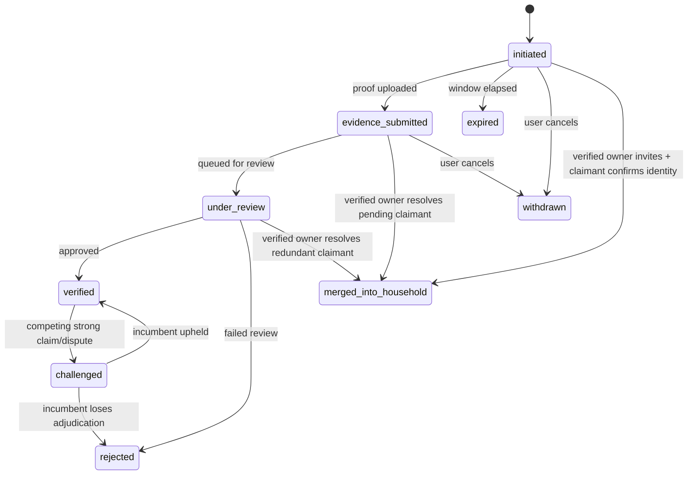
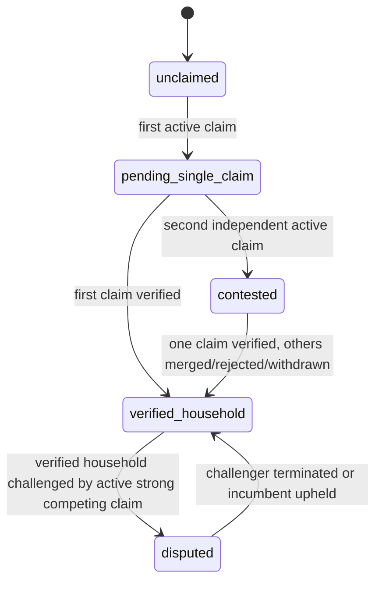

# Home Household Claim State Machine Design

## Purpose

Define a safe evolution path for home ownership and household verification so the app can:

- allow legitimate same-household claimants to proceed without unnecessary blocking
- preserve fraud resistance when a bad actor claims first
- support verified-owner invitation and merge flows
- add explicit dispute and challenge handling
- avoid breaking unrelated existing home, occupancy, invite, residency, or discovery flows

This document is intentionally scoped to the ownership/household claim domain. It does not redesign unrelated home features, general IAM, billing, mail, tasks, or address validation outside the claim-routing boundary.

## Current System Summary

Today the codebase already has:

- `HomeOwnershipClaim` with states `draft`, `submitted`, `needs_more_info`, `pending_review`, `pending_challenge_window`, `approved`, `rejected`, `disputed`, `revoked`
- `HomeOwner` and `HomeOccupancy` as separate concepts
- ownership evidence via `HomeVerificationEvidence`
- invite flows for co-owner / home membership
- dispute-related home security state via `Home.security_state`

Current behavior differs from the intended product model in one critical way:

- the system effectively enforces a single in-flight ownership claim per home, via `idx_home_claim_active_unique` and policy checks in `canSubmitOwnerClaim()`

That means:

- claimant B cannot independently upload ownership proof while claimant A has a pending ownership claim on the same home
- the "real owner arrives second" case is weaker than desired
- verified-owner invite/merge is not modeled as a first-class resolution path for another claimant's pending claim

## Product Goals

1. Metadata belongs to the home/address, not to the first claimant.
2. Proof belongs to the person making the claim.
3. Verified owners may invite household members and resolve redundant pending claims safely.
4. A later, stronger claim must be able to challenge an earlier, weaker or fraudulent claim.
5. The system must be understandable in admin tooling and auditable after the fact.
6. Rollout must preserve existing flows until each new phase is explicitly enabled.

## Non-Goals

- redesigning `AddressClaim` or the broader address-validation engine
- replacing `HomeOwner`, `HomeOccupancy`, or IAM with a different access model
- changing unrelated invite flows used by existing verified households
- introducing AI-scored document review in the first version

## Design Principles

### Metadata vs proof

- Home metadata is shared, reusable, and editable at the home level.
- Ownership or residency proof is claimant-specific and never implicitly inherited from another claimant.

### Invitation shortcuts

- Invitation may shortcut home-specific proof only after a verified household authority delegates trust.
- Invitation must not bypass identity confirmation.

### Stronger evidence beats earlier timestamps

- First claimant is not inherently stronger.
- Claim routing should prefer evidence quality, claim type, and review outcome over claim creation time.

### Explicit terminal outcomes

- Terminal claim outcomes must remain distinguishable for admin, audits, and metrics.
- Do not collapse all non-active outcomes into a single opaque `closed` state without a reason field.

## Target Domain Model

The system should model three related but distinct things:

1. Person-level claim lifecycle
2. Home-level household resolution state
3. Review strength and challenge/conflict state

### 1. Claim State

Recommended enum for person-level claim lifecycle:

- `initiated`
- `evidence_submitted`
- `under_review`
- `verified`
- `challenged`
- `withdrawn`
- `expired`
- `merged_into_household`
- `rejected`

Notes:

- `initiated` means started but no usable evidence yet
- `evidence_submitted` means proof exists and the claim is ready for review
- `under_review` means actively queued or being processed by admin/policy
- `challenged` means the claimant was previously verified or materially advanced, but is now under dispute
- `merged_into_household` is a terminal-but-successful outcome for a redundant claimant resolved by invite

If the existing `HomeOwnershipClaim.state` column must remain compatible, do not force an immediate full enum replacement in phase 1. Instead introduce a compatibility layer:

- add `claim_phase_v2`
- or keep current `state` and add `resolution_reason`, `challenge_state`, and `review_state`

### 2. Claim Terminal Reason

Recommended terminal reason enum:

- `withdrawn_by_user`
- `expired_no_evidence`
- `merged_via_invite`
- `rejected_review`
- `superseded_by_stronger_claim`
- `duplicate_redundant_claim`
- `revoked_after_challenge`

If claim state stays explicit (`withdrawn`, `expired`, `merged_into_household`, `rejected`), this field can still exist for analytics and admin explanation.

### 3. Home Household Resolution State

Recommended home-level state:

- `unclaimed`
- `pending_single_claim`
- `contested`
- `verified_household`
- `disputed`

Interpretation:

- `unclaimed`: no verified household authority and no active claimant
- `pending_single_claim`: one active independent claimant
- `contested`: multiple independent active claims exist and require adjudication
- `verified_household`: at least one verified household authority exists and the home is not currently disputed
- `disputed`: verified state is actively challenged by a non-terminal competing claim

This should be a new, explicit field rather than overloading `Home.security_state`. Existing `security_state` should remain focused on access restriction and operational sensitivity.

Recommended new field:

- `Home.household_resolution_state`

### 4. Claim Type

Retain explicit claimant intent:

- `owner`
- `resident`

Current support for `admin` can remain internally if needed, but ownership-vs-residency adjudication should primarily key off `owner` vs `resident`.

### 5. Evidence Confidence

Recommended initial enum:

- `low`
- `medium`
- `high`

This should be admin-assigned in the first iteration.

Store at minimum on evidence, optionally also rolled up to claim:

- `HomeVerificationEvidence.confidence_level`
- optional derived `HomeOwnershipClaim.claim_confidence_level`

### 6. Challenge State

Recommended explicit challenge field for claimants already verified or materially advanced:

- `none`
- `challenged`
- `resolved_upheld`
- `resolved_revoked`

This avoids overloading either `verified` or `disputed`.

## Evidence Strength Rubric

The system needs a deterministic hierarchy for routing and admin review.

### Document hierarchy

For ownership:

- deed / recorded title document
- escrow or title attestation
- closing disclosure / settlement statement
- mortgage statement
- property tax statement

For residency:

- lease agreement
- utility bill
- government mail

### Strength ordering

- ownership proof beats residency proof for ownership adjudication
- higher-confidence evidence beats lower-confidence evidence within the same category
- current and identity-aligned evidence beats stale or weakly matched evidence

### Admin tiebreak rubric

When two ownership claimants conflict:

1. Current recorded deed beats older deed or non-recorded ownership evidence.
2. Deed beats closing disclosure, mortgage statement, or property tax statement.
3. Exact legal name match beats partial or inferred match.
4. If both claimants present materially equivalent strong evidence, escalate to enhanced review requiring additional government ID or notarized supporting documents.

No routing or admin UI should rely on "who claimed first" as a tiebreaker.

## Core State Machines

### Claim lifecycle

### Home household resolution lifecycle

## Scenario Rules

### Scenario A: B claims same address while A is pending

Desired behavior:

- B is allowed to start an independent claim.
- Shared home metadata is prefilled from the current home record or prior accepted home-level metadata.
- B must submit their own evidence.
- Home moves from `pending_single_claim` to `contested` when B becomes an independent active claimant.
- Admin sees both claims side-by-side.

Important guardrail:

- B is not auto-merged into A's household while A is still unverified.

### Scenario B: A becomes verified first and B is still pending

Desired behavior:

- A sees that another claimant is pending for the same home.
- A may choose:
  - `invite_to_household`
  - `decline_relationship`
  - `flag_unknown_person`

Outcomes:

- if B accepts invite and passes identity confirmation, B's claim becomes `merged_into_household`
- B's uploaded evidence remains archived and auditable
- if A declines, B's claim continues independently
- if A flags unknown, B stays independent and the home may remain contested or move to disputed depending on state

### Scenario C: A is fake, B is the real owner, both still pending

Desired behavior:

- B is not blocked from submitting a claim
- B uploads stronger ownership evidence
- home enters `contested`
- admin review prioritizes the stronger ownership claim without auto-approving it

### Scenario D: A is already verified, B brings strong ownership proof

Desired behavior:

- B can file a challenge claim
- A's claim/owner status moves to `challenged`, not immediately revoked
- home moves to `disputed`
- admin adjudicates using side-by-side evidence
- if B wins, A loses verified authority and B becomes verified owner
- if B loses or abandons, A returns to normal verified status

## Invite and Merge Rules

### Invite eligibility

A verified household authority may invite B if:

- A is a verified owner or otherwise authorized household authority
- B either:
  - has an active pending claim on the home, or
  - is starting fresh as a household member/co-owner

### Invite does not skip identity

Invite-based fast path may skip home-proof collection only when:

- inviter is already verified
- claimant accepts invite
- claimant completes identity confirmation

### Explicit claim transitions

For a pending claimant:

- `initiated -> merged_into_household` is allowed only after identity confirmation
- `evidence_submitted -> merged_into_household` archives evidence and closes the claim successfully
- `under_review -> merged_into_household` is allowed only if the system or admin explicitly resolves the redundant review

### Invitation expiry

Recommended:

- 7 to 14 day invite expiry
- after expiry, claimant remains in their independent claim path

## Dispute Rules

### When to enter `disputed`

Home enters `disputed` when:

- a verified claimant is challenged by an active non-terminal competing claim with sufficiently strong ownership evidence
- admin explicitly flags the home for dispute

### What `disputed` restricts

While `disputed`:

- no ownership transfer
- no owner removal
- no primary owner change
- no household-proof shortcut via invite for new ownership authority

### How `disputed` exits

Home exits `disputed` automatically when:

- challenger is rejected, withdrawn, expired, or merged as non-owner household member
- incumbent is upheld and all competing claims are terminal
- challenger wins and the home returns to `verified_household` under the new verified authority

This must be handled by a background reconciliation job and also by synchronous state transitions where safe.

## Contested Escalation Rules

The system needs a timer, but should not silently auto-approve ownership based on admin delay.

Recommended policy:

- if a home remains `contested` for more than `N` days:
  - mark it as `stale_contested`
  - raise admin priority
  - notify operations
  - pause lower-strength claimant auto-progression

Avoid:

- auto-advancing a stronger ownership claimant to approval purely because the queue is slow

Rationale:

- queue delay is an operations problem
- ownership mistakes are materially worse than slower review

## Admin Tooling Requirements

No dispute-routing work should ship without minimum admin support.

### Required admin comparison view

For any contested or disputed home, admins must be able to see:

- all active claimants for the same home
- claimant type and current state
- side-by-side evidence list
- evidence confidence
- timestamps
- legal name match signals
- current verified owner/occupant graph
- invite history
- prior terminal claims on the same home
- audit timeline

### Required admin actions

- approve claim
- reject claim
- request more info
- mark challenger stronger / weaker
- merge claimant into household
- uphold incumbent
- revoke incumbent after successful challenge
- freeze home for support

## Compatibility Constraints

This work must not break unrelated existing features.

### Must preserve

- current `HomeOwner`, `HomeOccupancy`, and IAM semantics until replaced in a controlled migration
- existing invite acceptance for already-verified households
- existing residency claims flow outside new routing logic
- existing dashboard, mailbox, tasks, finance, and other home features
- current mobile/web routes until replacement UX is fully wired

### Phase 1 rule

Do not remove or reinterpret existing columns in place for the first rollout.

Prefer:

- additive schema changes
- compatibility adapters in backend policy
- feature-flagged behavior by route or policy version

## Proposed Schema Strategy

### Additive first

Recommended new or additive fields:

- `Home.household_resolution_state`
- `Home.household_resolution_updated_at`
- `HomeOwnershipClaim.claim_phase_v2` or equivalent compatibility field
- `HomeOwnershipClaim.terminal_reason`
- `HomeOwnershipClaim.challenge_state`
- `HomeOwnershipClaim.claim_strength`
- `HomeOwnershipClaim.merged_into_claim_id` or `merged_into_home_owner_id`
- `HomeVerificationEvidence.confidence_level`
- optional `HomeClaimRelationshipAction` table for verified-owner handling of other pending claimants

### Existing partial unique index

Current blocker:

- `idx_home_claim_active_unique` enforces one active ownership claim per home

Target:

- remove this hard uniqueness rule only after policy logic and admin tooling are ready
- replace it with routing logic based on claimant count, claim type, and home resolution state

## Backend Policy Changes

### Current

`canSubmitOwnerClaim()` blocks another claimant when another in-flight claim exists.

### Target

`canSubmitOwnerClaim()` should:

- allow multiple independent claimants on the same home
- classify submission as:
  - independent pending claim
  - challenge claim
  - redundant claimant eligible for invite resolution
- set or recalculate `household_resolution_state`
- avoid granting access based solely on claim submission

### New service boundaries

Add a dedicated routing/reconciliation service for:

- claim submission classification
- home resolution state updates
- challenge detection
- merge resolution
- dispute exit cleanup

Do not continue to spread this logic only across route handlers.

## API Changes

Recommended additive API behavior:

- keep existing endpoints stable initially
- add richer response metadata behind additive fields

Examples:

- `POST /:id/ownership-claims`
  - returns claim id and routing classification
  - indicates `pending_single_claim`, `contested`, or `disputed`
- `GET /:id/ownership-claims`
  - supports grouped by home-resolution state
- new admin/owner action endpoints
  - resolve claimant via invite
  - flag claimant unknown
  - challenge verified owner

## UX Requirements

### Claimant copy

When another claim already exists, do not show a hard block by default.

Instead:

- explain that another claim exists
- allow independent submission
- clarify that if a verified household member invites them later, they may skip further home-proof review

### Verified owner copy

When another claimant is pending:

- "Another person submitted a claim for this address."
- actions:
  - invite to household
  - I do not know this person
  - keep under review

### Challenger copy

For strong ownership conflicts:

- "This address already has a verified household. If you are the rightful owner, you can submit ownership proof to challenge the current verification."

## Rollout Plan

### Phase 0: Design and instrumentation

- finalize enums and transitions
- add analytics and admin metrics around current ownership claim failures
- inventory all places that depend on current ownership claim states

### Phase 1: Additive schema and read-path support

- add new fields and compatibility mappings
- add admin comparison view
- add reconciliation job skeleton
- no user-facing policy change yet

### Phase 2: Parallel claim support behind feature flag

- remove dependency on one-active-claim-per-home behavior
- allow multiple independent pending claims for flagged cohorts
- set `household_resolution_state`
- keep current invite and approval flows otherwise intact

### Phase 3: Invite/merge resolution

- add verified-owner handling of pending redundant claimants
- preserve claimant evidence on merge
- require identity confirmation for invite shortcut

### Phase 4: Challenge and dispute hardening

- add explicit challenged state
- add dispute entry/exit reconciliation
- add incumbent uphold / revoke actions

### Phase 5: Cleanup and migration

- migrate old state interpretations to new explicit fields
- remove obsolete policy branches
- drop hard unique active-claim constraint only after all consumers are migrated

## Risks

### Risk: accidental access grant

If claim state and occupancy/owner status are conflated, claimants may gain home access too early.

Mitigation:

- keep claim state separate from verified authority and occupancy status

### Risk: unresolved contested homes

If contested homes do not reconcile automatically, users get stuck indefinitely.

Mitigation:

- reconciliation job
- admin SLA alerts
- explicit stale contested queue

### Risk: merge destroys evidence history

If merged claims are hard-deleted or overwritten, audits and future disputes weaken.

Mitigation:

- preserve evidence and mark merged terminal reason explicitly

### Risk: breaking current app flows

Current routes, screens, and policy checks assume old claim state semantics.

Mitigation:

- additive rollout
- route compatibility adapters
- feature flags
- no in-place destructive enum replacement in the first iteration

## Open Questions

1. Should `owner` and `resident` remain on one claim table, or split into specialized tables with a shared wrapper?
2. Which roles are allowed to resolve another claimant via invite: verified owner only, or also designated admins/managers?
3. Should challenge claims require minimum evidence threshold before they can move a home into `disputed`?
4. Should home metadata edits from unverified claimants be auto-applied, staged for confirmation, or stored as claimant suggestions?
5. Do we want explicit `stale_contested` as a persisted state, or just a derived operational flag?

## Recommended Immediate Next Step

Before implementation, write a smaller follow-up spec that freezes:

- final enums
- transition matrix
- admin actions
- compatibility mapping from current `HomeOwnershipClaim.state` to the new model

That smaller spec should be the implementation contract used for migrations and backend changes.
