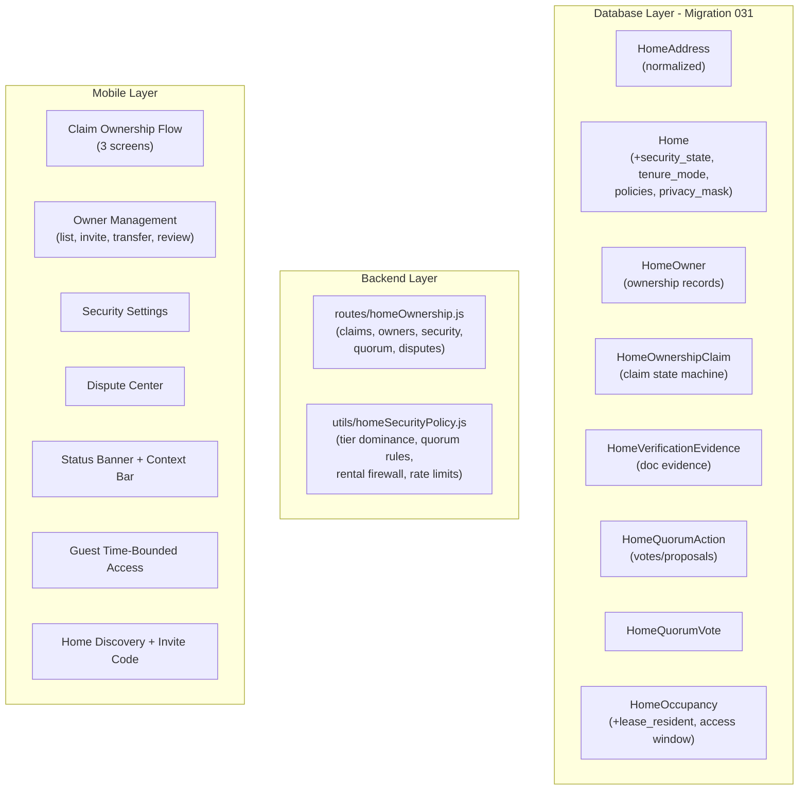

# Home Ownership, Identity, Residency and Dispute System

> **Historical context:** Written while the mobile client was React Native at `frontend/apps/mobile/`. That app has been replaced by native iOS ([`frontend/apps/ios`](../frontend/apps/ios)) and Android ([`frontend/apps/android`](../frontend/apps/android)). Mobile paths in this plan should be mapped to those native projects; see the root README "Migration notes (from React Native)" section.

## Current State

- **Database**: Supabase/PostgreSQL. Schema in `[backend/database/schema.sql](backend/database/schema.sql)`. Latest migration: `030_context_convert_system.sql`.
- **Home table**: Flat address fields (address, city, state, zipcode, address2, country, location). Single `owner_id` FK. No security state, no claim policies, no tenure mode.
- **HomeOccupancy**: Membership table with role check constraint. No `lease_resident` or `service_provider` roles. No `access_start_at`/`access_end_at`.
- **HomeResidencyClaim**: Basic residency claims only (pending/verified/rejected). No ownership claim concept.
- **HomeVerification**: Basic methods (mail_code, lease_upload, utility_bill, neighbor_vouch, gps_check). No evidence chaining, no verification tiers.
- **HomeAuditLog**: Exists with action/metadata. No before/after snapshots.
- **Backend**: Express.js. `[backend/routes/home.js](backend/routes/home.js)` has ~4134 lines with 50+ endpoints. Uses `[backend/utils/homePermissions.js](backend/utils/homePermissions.js)` for IAM.
- **Mobile**: Expo Router. Only 3 home screens: list, new, dashboard at `[frontend/apps/mobile/src/app/homes/](frontend/apps/mobile/src/app/homes/)`.
- **API package**: `[frontend/packages/api/src/endpoints/homes.ts](frontend/packages/api/src/endpoints/homes.ts)` has residency claim methods but no ownership claim APIs.

## Architecture

---

## Part 1: SQL Migration Script

File: `[backend/database/migrations/031_home_ownership_identity_system.sql](backend/database/migrations/031_home_ownership_identity_system.sql)`

### 1a. New ENUM types (11 types)

- `home_security_state`: normal, claim_window, review_required, disputed, frozen, frozen_silent
- `home_tenure_mode`: unknown, owner_occupied, rental, managed_property
- `home_privacy_mask_level`: normal, high, invite_only_discovery
- `home_member_attach_policy`: open_invite, admin_approval, verified_only
- `home_owner_claim_policy`: open, review_required
- `ownership_claim_state`: draft, submitted, needs_more_info, pending_review, pending_challenge_window, approved, rejected, disputed, revoked
- `ownership_claim_method`: invite, vouch, doc_upload, escrow_agent, landlord_portal, property_data_match
- `owner_verification_tier`: weak, standard, strong, legal
- `owner_status_type`: pending, verified, disputed, revoked
- `owner_added_via`: claim, transfer, escrow, landlord_portal
- `quorum_action_state`: proposed, collecting_votes, approved, rejected, expired

### 1b. New `HomeAddress` table

Normalized address identity with `address_hash` for dedup. Existing `Home` rows keep their inline address fields for backward compat; new column `address_id` (nullable FK) added to `Home`. A SQL function `normalize_address_hash()` generates deterministic hashes.

### 1c. ALTER `Home` table - add columns

- `address_id` uuid nullable FK -> HomeAddress
- `parent_home_id` uuid nullable FK -> Home (building/unit hierarchy)
- `home_status` text default 'active' (active/merged/archived)
- `canonical_home_id` uuid nullable (if merged)
- `security_state` home_security_state default 'normal'
- `claim_window_ends_at` timestamptz nullable
- `member_attach_policy` home_member_attach_policy default 'open_invite'
- `owner_claim_policy` home_owner_claim_policy default 'open'
- `privacy_mask_level` home_privacy_mask_level default 'normal'
- `tenure_mode` home_tenure_mode default 'unknown'
- `address_hash` text (computed from normalized address)
- `place_type` text (single_family/unit/building/multi_parcel/rv_spot/unknown)
- `created_by_user_id` uuid nullable FK -> User

### 1d. New `HomeOwner` table

Separate from HomeOccupancy. Fields: home_id, subject_type (user/business/trust), subject_id, owner_status, is_primary_owner, added_via, verification_tier, timestamps. Constraint: max one is_primary_owner per home.

### 1e. New `HomeOwnershipClaim` table

Full claim state machine: claim_id, home_id, claimant_user_id, claim_type, state (9 states), method (6 methods), risk_score, challenge_window_ends_at, timestamps.

### 1f. New `HomeVerificationEvidence` table

Linked to claims: claim_id, evidence_type, provider, status, redaction_status, storage_ref (pointer, not raw doc), metadata, timestamps.

### 1g. New `HomeQuorumAction` + `HomeQuorumVote` tables

QuorumAction: action_type, state, risk_tier (0-3), required_rule, required_approvals, min_rejects_to_block, expires_at, passive_approval_at, home_id, proposed_by, metadata.

QuorumVote: quorum_action_id, voter_user_id, vote (approve/reject), reason, voted_at.

### 1h. ALTER `HomeOccupancy`

- Add `lease_resident` and `service_provider` to role CHECK constraint
- Add `access_start_at` timestamptz, `access_end_at` timestamptz columns
- Add `added_by_user_id` uuid nullable

### 1i. ALTER `home_role_base` enum

- Add values: `lease_resident`, `service_provider`

### 1j. ALTER `home_permission` enum

- Add values: `ownership.view`, `ownership.manage`, `ownership.transfer`, `security.manage`, `dispute.view`, `dispute.manage`, `quorum.vote`, `quorum.propose`

### 1k. ALTER `HomeAuditLog`

- Add `before_data` jsonb, `after_data` jsonb for sensitive change diffs

### 1l. Indexes

- Unique partial index on HomeOwner (home_id) WHERE is_primary_owner = true
- Index on HomeOwnershipClaim (home_id, state)
- Index on HomeOwnershipClaim (claimant_user_id, state)
- Index on HomeQuorumAction (home_id, state)
- Index on Home (address_hash) WHERE home_status = 'active'
- Index on HomeAddress (address_hash) UNIQUE

### 1m. RLS policies

- Enable RLS on all new tables
- HomeOwner: owners can see co-owners of their home; others see nothing
- HomeOwnershipClaim: claimant sees own claim only; owners see claims on their homes
- HomeVerificationEvidence: claim owner or home owners can view
- HomeQuorumAction/Vote: home owners can view and vote

---

## Part 2: Backend

### 2a. New file: `[backend/utils/homeSecurityPolicy.js](backend/utils/homeSecurityPolicy.js)`

Core policy enforcement module:

- `canSubmitOwnerClaim(homeId, userId)` - rate limits, rental firewall, cooldown checks
- `getRequiredVerificationTier(home, existingOwners)` - tier dominance logic
- `calculateQuorumRequirement(actionType, homeId)` - risk tier -> approval rules
- `isClaimWindowActive(home)` - check if claim window is open
- `canChangeOwnerClaimPolicy(home)` - claim window blocks policy tightening
- `evaluateRentalFirewall(home, claimMethod)` - block soft-doc claims on rentals
- `shouldTriggerDispute(home, claim, existingOwners)` - conflict detection
- `getClaimRiskScore(claim, claimant)` - risk scoring

### 2b. New file: `[backend/routes/homeOwnership.js](backend/routes/homeOwnership.js)`

Mounted at `/api/homes` alongside existing home routes. Endpoints:

**Ownership Claims:**

- `POST /:id/ownership-claims` - Submit ownership claim (opaque handshake response)
- `GET /my-ownership-claims` - Get my claims (always generic status)
- `GET /:id/ownership-claims` - List claims (owner-only, shows claimant details)
- `GET /:id/ownership-claims/:claimId` - Claim details (owner-only)
- `POST /:id/ownership-claims/:claimId/review` - Approve/reject/flag (owner-only)
- `POST /:id/ownership-claims/:claimId/evidence` - Upload evidence

**Owners:**

- `GET /:id/owners` - List verified owners with tiers
- `POST /:id/owners/invite` - Invite co-owner
- `POST /:id/owners/transfer` - Initiate transfer (Tier 3 quorum)
- `DELETE /:id/owners/:ownerId` - Remove owner (Tier 3 quorum)

**Security Settings:**

- `GET /:id/security` - Get security state + policies
- `PATCH /:id/security` - Update policies (may trigger quorum)

**Quorum:**

- `GET /:id/quorum-actions` - List pending actions
- `POST /:id/quorum-actions` - Propose action
- `POST /:id/quorum-actions/:actionId/vote` - Vote

**Dispute:**

- `GET /:id/dispute` - Dispute details + timeline

### 2c. Modify `[backend/routes/home.js](backend/routes/home.js)`

- Update `POST /` (create home) to also create HomeOwner record + set initial security_state
- Update `GET /:id` to include security_state, owners, policies in response
- Update `GET /discover` to respect privacy_mask_level
- Import and mount homeOwnership routes

### 2d. Modify `[backend/utils/homePermissions.js](backend/utils/homePermissions.js)`

- Add ownership-based permission checks (uses HomeOwner table, not just HomeOccupancy)
- Add `isVerifiedOwner(homeId, userId)` helper
- Update `checkHomePermission` to handle new permission types

---

## Part 3: API Package

### 3a. New file: `[frontend/packages/api/src/endpoints/homeOwnership.ts](frontend/packages/api/src/endpoints/homeOwnership.ts)`

All ownership-related API methods:

- `submitOwnershipClaim`, `getMyOwnershipClaims`
- `getHomeOwnershipClaims`, `reviewOwnershipClaim`
- `uploadClaimEvidence`
- `getHomeOwners`, `inviteCoOwner`, `transferOwnership`, `removeOwner`
- `getSecuritySettings`, `updateSecuritySettings`
- `getQuorumActions`, `proposeQuorumAction`, `voteOnQuorumAction`
- `getDisputeDetails`

### 3b. Update `[frontend/packages/api/src/index.ts](frontend/packages/api/src/index.ts)`

Export new module as `homeOwnership` namespace.

---

## Part 4: Mobile Frontend

### 4a. New Screens (12 screens)

All under `[frontend/apps/mobile/src/app/homes/](frontend/apps/mobile/src/app/homes/)`:

- `find.tsx` - Home discovery (address search + invite code entry)
- `[id]/claim-owner/index.tsx` - Start ownership claim (method picker)
- `[id]/claim-owner/evidence.tsx` - Upload evidence
- `[id]/claim-owner/submitted.tsx` - Generic "under review" (opaque handshake)
- `[id]/owners/index.tsx` - Owners list with verification tier badges
- `[id]/owners/invite.tsx` - Invite co-owner
- `[id]/owners/transfer.tsx` - Transfer ownership
- `[id]/owners/review-claim.tsx` - Review incoming claim (owner-only, masked claimant)
- `[id]/settings/security.tsx` - Ownership & Security settings (policies, privacy mask)
- `[id]/dispute.tsx` - Dispute center (timeline, restricted actions list)
- `[id]/members/add-guest.tsx` - Add time-bounded guest
- `invite.tsx` - Enter invite code screen

### 4b. New Components (5 components)

In `[frontend/apps/mobile/src/components/](frontend/apps/mobile/src/components/)`:

- `HomeStatusBanner.tsx` - Color-coded banner per security_state (normal/claim_window/review_required/disputed/frozen + CTAs)
- `QuorumModal.tsx` - Approval modal for Tier 2 (constructive consent countdown) and Tier 3 (explicit approval) actions
- `SensitiveActionGuard.tsx` - Wraps Tier 2-3 actions with impact summary + approval requirement
- `OwnerVerificationBadge.tsx` - Badge showing weak/standard/strong/legal tier
- `ClaimantCard.tsx` - Masked claimant info card for owners reviewing claims

### 4c. Update Existing Screens

- Update `[id]/dashboard.tsx` to show `HomeStatusBanner` and ownership tab
- Update `ContextBar.tsx` to show security_state chip and "Claim Ownership" option
- Update `new.tsx` to set initial tenure_mode and create HomeOwner record

### 4d. Copy Strings

Add a new constants file `frontend/apps/mobile/src/constants/ownershipCopy.ts` with all messaging library strings from the spec (claim status, co-owner invite, claim window, dispute, quorum, rental firewall, frozen).

---

## Execution Order

The work is sequenced so each layer builds on the previous:

1. SQL migration script (standalone, user runs manually)
2. Backend security policy utility
3. Backend ownership routes
4. API package endpoints
5. Mobile components (banner, modals, badges)
6. Mobile screens (claim flow, owner management, security, dispute, discovery)
7. Integration updates (dashboard, context bar, home creation)

