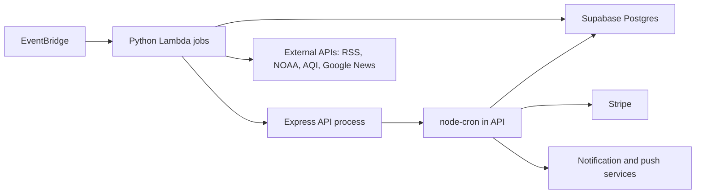

# Background Jobs, Cron, Lambda, Queues, and Operations

Interview preparation notes for Pantopus background job architecture.

This document answers the following questions in depth:

1. Why are many cron jobs run inside the API process?
2. What prevents duplicate job execution if two backend containers run?
3. Which jobs are safe to run more than once?
4. Which jobs need distributed locks?
5. How do you observe job duration, failure rate, and backlog?
6. What happens when a job exceeds its schedule interval?
7. How are retries and poison records handled?
8. Why are some async workloads in Lambda seeder code while others are in backend cron?
9. What would you move to a queue first?
10. What is the operational runbook when jobs silently stop?

The answer is intentionally written as an interview-quality explanation: it distinguishes current implementation, risks, design intent, and what I would improve next.

## Executive Summary

Pantopus currently uses two scheduled-work systems:

- Backend `node-cron` jobs run inside the Express API process. They are registered in `backend/jobs/index.js` and started from `backend/app.js` after the HTTP server begins listening.
- AWS Lambda jobs in `pantopus-seeder` are scheduled by EventBridge and handle content seeding, briefings, alerts, home reminders, mail notifications, and no-bid nudges.

The backend cron design was a pragmatic monolith choice. It let us ship quickly because the API process already had direct access to the domain services that jobs need: Supabase admin, Stripe, wallet ledger, notification service, home permission helpers, marketplace services, logger, and runtime config.

That architecture is acceptable while there is exactly one backend scheduler. It becomes risky when the backend is horizontally scaled, because every API container calls `startJobs()` and there is no deployed global scheduler lock in the current `node-cron` runner.

The codebase partially protects itself through idempotent writes, optimistic status predicates, unique constraints, upserts, and payment idempotency keys. Those protections reduce blast radius, but they are not a substitute for singleton execution for financial and side-effect-heavy jobs.

The right target architecture is already described in `docs/05-cron-job-migration-plan.md`: move critical jobs to EventBridge/Lambda trigger endpoints guarded by a `job_locks` table, move frequent medium-weight jobs to pg-boss, and retain only lightweight, idempotent jobs in in-process cron.

## Current Architecture

### Backend cron

The backend imports all job modules in `backend/jobs/index.js`, wraps them in `wrapJob(name, fn)`, and schedules them with `node-cron`.

Important current behavior:

- Jobs are registered when `startJobs()` runs.
- `startJobs()` skips only when `NODE_ENV === 'test'`.
- Every schedule uses UTC.
- `wrapJob()` logs start, completion, failure, and elapsed milliseconds.
- A thrown error in one job is caught so the API process does not crash.
- There is no global no-overlap option, distributed lock, or durable job-run table in the active runner.

Relevant files:

- `backend/app.js`
- `backend/jobs/index.js`
- `backend/jobs/*.js`
- `docs/03-jobs-stripe-realtime.md`
- `docs/cron-jobs-and-lambda-functions-design-doc.md`
- `docs/05-cron-job-migration-plan.md`

### Lambda scheduled jobs

The Lambda side lives under `pantopus-seeder`.

The SAM template defines EventBridge schedules for:

- Seeder fetcher
- Seeder poster
- Sports national fetcher
- Sports poster
- Region discovery
- Briefing scheduler
- Briefing cleanup
- Alert checker
- Home reminders
- Mail notifications
- No-bid nudge

Relevant files:

- `pantopus-seeder/deploy/template.yaml`
- `pantopus-seeder/src/handlers/*.py`
- `docs/04-lambda-functions-seeder.md`
- `docs/seeder-deployment-guide.md`

### Simplified architecture diagram



## Question 1: Why Are Many Cron Jobs Run Inside the API Process?

There are four main reasons.

### 1. Shared domain services

Many jobs are not isolated scripts. They call the same domain services as user-facing routes:

- `stripeService`
- `walletService`
- `notificationService`
- `homeClaimRoutingService`
- `homePermissions`
- marketplace services
- Supabase admin client
- centralized logger and config

Running jobs in the API avoided duplicating business logic in another runtime.

For example, `processPendingTransfers` does not just update a timestamp. It transitions a payment state, credits a wallet, updates gig state, emits notifications, and sends operational alerts. Keeping that in the backend means it uses the same payment state machine and wallet ledger code as the rest of the product.

### 2. Faster early-stage delivery

In-process cron has almost no infrastructure overhead:

- no worker deployment
- no queue system
- no EventBridge rules
- no additional credentials
- no separate Docker target
- no queue dashboard to operate

For an early product, this is a reasonable way to get reliable-enough background automation while preserving focus on product workflows.

### 3. Jobs started as local state reconciliation

Many jobs are periodic reconciliation jobs:

- expire old rows
- recompute caches
- reconcile denormalized state
- refresh scores
- clean up stale records

Those are historically easy to model as "scan the database every N minutes and converge state."

Examples:

- `expireGigs`
- `expireListings`
- `autoArchivePosts`
- `recomputeUtilityScores`
- `computeReputation`
- `reconcileHomeHouseholdResolution`

These jobs are less like event processing and more like maintenance passes.

### 4. Operational simplicity for one backend replica

When there is exactly one backend container, `node-cron` inside the API has predictable behavior:

- one scheduler
- one set of logs
- no distributed coordination
- no lock contention
- easy local development

The tradeoff is that the architecture relies on an implicit deployment invariant: only one API process should run cron. That invariant is brittle unless enforced by deployment topology or code.

### Interview framing

I would phrase it this way:

> I put many cron jobs inside the API process because the initial system was a pragmatic monolith. The jobs needed the same domain services as the API, especially Stripe, wallet ledger, home-claim state, and notifications. For a single backend container, in-process cron kept the system simple and avoided duplicated business logic. The tradeoff is that once we scale the API horizontally, the scheduler must either be disabled on all but one replica or replaced by distributed locks, a queue, or external scheduling.

## Question 2: What Prevents Duplicate Job Execution If Two Backend Containers Run?

### Current honest answer

At the scheduler level: nothing sufficient.

If two backend containers boot with `NODE_ENV !== 'test'`, both will call `startJobs()`. Both will register the same `node-cron` schedules. At each matching minute, both containers can execute the same job.

The current system relies on job-local protections, not a global singleton scheduler.

### Existing duplicate-reduction mechanisms

The codebase contains several patterns that reduce duplicate damage.

#### Status predicates

Many jobs update only rows that are still in a particular state.

Examples:

- `expireGigs` updates `Gig` rows only where `status = 'open'`.
- `expireListings` updates `Listing` rows only where `status = 'active'`.
- `expireInitiatedHomeClaims` updates claims only where `claim_phase_v2 = 'initiated'`.
- `chatRedactionJob` updates deleted messages only where the message is not already redacted.

This means a second run usually sees fewer or no rows.

#### Optimistic guards

Some jobs re-check state just before mutation.

`processPendingTransfers` re-fetches the payment and skips if it is no longer `captured_hold` or has a dispute. It also attempts to transition to `transfer_scheduled` before crediting the wallet.

This is a good pattern, but it is not a perfect distributed lock because the payment state transition function itself fetches and updates in separate steps rather than performing a single compare-and-swap update.

#### Unique constraints

The database prevents some duplicate records:

- `Stamp` has a unique key on `(user_id, stamp_type)`.
- `WalletTransaction` has a unique `idempotency_key`.
- `DailyBriefingDelivery` has idempotency by user/date/kind.
- `seeder_content_queue` has a dedup index for content hashes.

Unique constraints are one of the strongest protections in the system because they work across all processes.

#### Upserts

Some jobs use upserts so repeat execution converges:

- `MonthlyReceipt` upserts by `(user_id, year, month)`.
- `BillBenchmark` upserts by `(geohash, bill_type, month, year)`.
- `NeighborhoodPreview` upserts by geohash.
- `HomeOccupancy` is upserted by `(home_id, user_id)` through `applyOccupancyTemplate`.

#### Idempotency keys

Wallet credits are guarded with deterministic idempotency keys:

- `gig_income:${paymentId}`
- `tip_income:${paymentId}`
- `refund:${paymentId}`

That is critical. Even if transfer processing is attempted twice, the ledger function should return the existing wallet transaction instead of crediting twice.

#### Notification dedup checks

Several jobs check existing notifications or event rows before sending. This helps but is weaker than a unique constraint because check-then-insert can race.

### What does not exist yet

The migration plan proposes a `job_locks` table and RPC functions such as `acquire_job_lock` and `release_job_lock`. That is the right direction, but it is documented as a plan; it is not currently wired around the active backend cron runner.

There is also no pg-boss worker currently registered for the backend cron jobs.

### Interview framing

> Today, duplicate execution is prevented only at the data mutation level, not at the scheduler level. We rely on state predicates, upserts, unique constraints, idempotency keys, and some optimistic state checks. That is enough for many reconciliation jobs, but it is not enough for financial jobs or side-effect fanout. The next step is a durable distributed lock or queue-level singleton semantics so that only one worker owns each scheduled execution or each record-level unit of work.

## Question 3: Which Jobs Are Safe To Run More Than Once?

"Safe" needs a precise definition.

A job is safe to run more than once if repeating it produces the same durable state and does not duplicate irreversible side effects like charges, wallet credits, emails, push notifications, destructive deletes, or external API calls with consequences.

I classify jobs into four buckets:

1. Strongly idempotent
2. Mostly idempotent but duplicate side effects are possible
3. Race-sensitive
4. Must be singleton or queue-owned

### Strongly idempotent or convergent jobs

These jobs mostly recompute or converge durable state.

| Job | Why it is relatively safe |
| --- | --- |
| `recomputeUtilityScores` | Computes deterministic scores and updates only changed post scores. |
| `computeReputation` | Recomputes reputation for recently active users. Repeating should converge. |
| `computeAvgResponseTime` | Recomputes average response minutes and overwrites the aggregate. |
| `billBenchmarkRefresh` | Computes aggregate benchmarks and upserts by benchmark key. |
| `refreshDiscoveryCache` | Refreshes cache rows for geohashes. |
| `reconcileHomeHouseholdResolution` | Recomputes home resolution from current claims and owners. |
| `chatRedactionJob` | Redacts messages where `deleted=true` and message is not already redacted. |
| `autoArchivePosts` | Archives posts where `archived_at` is null and TTL has passed. |
| `expireGigs` | Cancels only `open` gigs past deadline. |
| `expireInitiatedHomeClaims` | Expires claims still in `initiated`. |
| `vacationHoldExpiry` | Moves scheduled/active vacation holds to their next state. |

Even here, "safe" assumes updates do not also send unguarded notifications. A state update may be safe while attached side effects are not.

### Mostly idempotent, but duplicate notifications or counters are possible

| Job | Safe state behavior | Duplicate risk |
| --- | --- | --- |
| `mailPartyExpiry` | Marks pending sessions expired. | Logs `MailEvent` after update; duplicate events possible if two runners select the same pending session. |
| `mailInterruptNotification` | Checks `MailEvent` before insert. | Check-then-insert race without unique constraint. |
| `notifyClaimWindowExpiry` | Checks existing notification metadata. | Check-then-insert race without unique constraint. |
| `autoRemindWorker` | Updates reminder count before notification. | Update lacks compare-and-swap on the old count, so two runners can both update/send. |
| `supportTrainReminders` | Uses `last_reminder_sent` as guard. | Query and update are not atomic; duplicate reminders possible. |
| `draftBusinessReminder` | Caps at three reminders. | Two runners can both read the same count, send duplicate email/notification, then write the same or incremented count. |
| `monthlyReceiptJob` | Receipt row is upserted. | Notification and email can duplicate. |
| `neighborhoodPreviewRefresh` | Preview row upserts and milestone field helps. | Notification fanout can duplicate under race. |
| `stampAwarder` | DB unique key protects duplicate stamps. | The job can hit unique constraint errors unless insert is converted to upsert/ignore. |

### Race-sensitive jobs

These jobs interact with counters, external systems, or non-atomic transitions.

| Job | Risk |
| --- | --- |
| `expireOffers` | Bulk updates offer status, then decrements `active_offer_count`. Concurrent runs can double-decrement or duplicate buyer notifications. |
| `expireListings` | Listing status update is guarded, but inventory slot decrement is a follow-up read/update. |
| `expirePendingPaymentBids` | Cancels Stripe intent and reverts bid. Needs one owner per bid. |
| `validateHomeCoordinates` | External Mapbox calls and updates are convergent, but concurrent runs can double-call provider and log duplicate warnings. |
| `processClaimWindows` | Occupancy upsert is safe, but notifications and audit logs can duplicate. |
| `earnRiskReview` | Suspension creation checks existing count, then inserts. That check can race. |
| `communityModeration` | Checks existing event before insert; possible duplicate moderation event. |

### Must not double-run

These jobs should have distributed locks or be moved to queues before horizontal scaling.

| Job | Why |
| --- | --- |
| `processPendingTransfers` | Credits provider wallet and finalizes payment state. Money movement must have exactly-once effects. |
| `authorizeUpcomingGigs` | Creates off-session Stripe PaymentIntents. Duplicate execution can create multiple Stripe intents unless locked or idempotency keys are added. |
| `retryCaptureFailures` | Calls Stripe capture. Stripe may reject duplicate capture, but we should not rely on provider error handling as our concurrency model. |
| `expireUncapturedAuthorizations` | Cancels holds, cancels gigs, sends critical notifications. |
| `cleanupGhostBusinesses` | Deletes `User` rows and cascades business records. |
| `monthlyReceiptJob` | Email and notification fanout to many active users. |
| `draftBusinessReminder` | Email fanout with reminder count race. |
| Seeder `poster` | Selects queued content, humanizes with AI, posts to API. Needs atomic row reservation to prevent duplicate posts. |

## Question 4: Which Jobs Need Distributed Locks?

There are two levels of locking:

1. Job-level singleton lock: only one instance of the whole job runs at a time.
2. Record-level ownership: multiple workers may run, but each record is atomically claimed by exactly one worker.

Record-level ownership is usually better for throughput and retries. Job-level locks are simpler and acceptable for low-volume scheduled jobs.

### Jobs that need job-level locks

These jobs are batch maintenance jobs where one concurrent run is enough.

| Job | Lock TTL suggestion |
| --- | --- |
| `cleanupGhostBusinesses` | 30 minutes |
| `chatRedactionJob` | 30 minutes |
| `trustAnomalyDetection` | 30 minutes |
| `computeAvgResponseTime` | 60 minutes |
| `autoArchivePosts` | 30 minutes |
| `billBenchmarkRefresh` | 60 minutes |
| `monthlyReceiptJob` | 2 hours |
| `neighborhoodPreviewRefresh` | 30 minutes |

### Jobs that need record-level locks or queues

These should not just lock the whole job forever; each unit of work should be claimable.

| Job | Unit of work |
| --- | --- |
| `processPendingTransfers` | Payment ID |
| `authorizeUpcomingGigs` | Payment/Gig ID |
| `retryCaptureFailures` | Payment ID |
| `expirePendingPaymentBids` | Bid ID |
| `supportTrainReminders` | Reservation ID or support train ID |
| `autoRemindWorker` | Gig ID |
| `mailEscrowExpiry` | Mail ID |
| `draftBusinessReminder` | Business profile ID |
| `notifyClaimWindowExpiry` | Home ID plus user ID |
| Seeder poster | Queue item ID |
| Briefing delivery | User ID plus local date plus briefing kind |

### Recommended lock implementation

For Phase 1, use a `job_locks` table:

```sql
CREATE TABLE job_locks (
  job_name text PRIMARY KEY,
  locked_by text NOT NULL,
  locked_at timestamptz NOT NULL DEFAULT now(),
  expires_at timestamptz NOT NULL,
  run_count bigint NOT NULL DEFAULT 0,
  last_success timestamptz,
  last_failure timestamptz,
  last_error text
);
```

Acquire atomically with `INSERT ... ON CONFLICT ... WHERE expires_at < now()`.

For Phase 2, move frequent jobs to pg-boss. The value of pg-boss is not just locking. It also gives us:

- durable job rows
- retry count
- backoff
- active/completed/failed state
- worker concurrency controls
- queue backlog
- a natural dead-letter pattern

### Why not only `pg_advisory_lock`?

Postgres advisory locks are useful, but they are invisible unless you inspect `pg_locks`, and they disappear with session termination. For scheduled jobs I prefer a lock table because it doubles as operational state:

- who holds the lock
- when it was acquired
- when it expires
- last success
- last failure
- last error

The migration plan makes the same design call.

## Question 5: How Do You Observe Job Duration, Failure Rate, and Backlog?

### Current observability

#### Backend cron duration

The current `wrapJob()` logs elapsed time:

```js
logger.info(`[CRON] Completed: ${name}`, { elapsed_ms: elapsed });
logger.error(`[CRON] Failed: ${name}`, { error, stack, elapsed_ms });
```

This gives duration and failure visibility in logs. It does not give durable metrics, dashboards, or a queryable run history.

#### Backend API route metrics

The API has an APM middleware that tracks route response time in memory and exposes `/api/health/metrics`. That is useful for HTTP routes, but it is not sufficient for cron jobs.

#### Payment alerting

Some payment jobs use `alertingService` to send Slack/PagerDuty alerts. `processPendingTransfers` sends warnings or critical alerts when errors occur.

That is good targeted alerting for high-risk flows.

#### Lambda metrics

AWS gives every Lambda:

- invocations
- errors
- duration
- throttles
- concurrent executions

Several Lambda handlers also publish custom CloudWatch metrics:

- `SeederQueueDepth`
- briefing eligible/sent/skipped/failed/latency
- alert geohashes checked/weather alerts/AQI/users notified
- home reminder counts/latency
- mail notification counts/latency
- no-bid nudge counts/latency

### Backlog observability

Backlog is not a single number. It depends on the job.

Examples:

| Workload | Backlog query concept |
| --- | --- |
| Seeder fetch/post | Count `seeder_content_queue` where `status = 'queued'`; age of oldest queued row. |
| Briefings | Count `DailyBriefingDelivery` where status is `queued`, `composing`, or `failed`; stale `composing` age. |
| Transfers | Count `Payment` where `payment_status = 'captured_hold'` and `cooling_off_ends_at <= now()`. |
| Capture retry | Count `Payment`/`Gig` rows in authorized state after completion with attempts below cap. |
| Pending bids | Count `GigBid` where `status = 'pending_payment'` and expiry has passed. |
| Home coordinate validation | Count active recent homes where `coordinate_validation is null`. |
| Mail escrow | Count `Mail` where `escrow_status = 'pending'` and `escrow_expires_at < now()`. |
| Support train reminders | Count eligible reservations/slots not yet reminded. |

### What I would add

I would add a durable `JobRun` table:

```sql
CREATE TABLE job_runs (
  id uuid PRIMARY KEY DEFAULT gen_random_uuid(),
  job_name text NOT NULL,
  scheduled_for timestamptz,
  started_at timestamptz NOT NULL DEFAULT now(),
  finished_at timestamptz,
  status text NOT NULL CHECK (status IN ('running', 'succeeded', 'failed', 'skipped')),
  locked_by text,
  duration_ms integer,
  records_scanned integer,
  records_changed integer,
  records_failed integer,
  error text,
  metadata jsonb NOT NULL DEFAULT '{}'
);
```

Then every job wrapper records:

- run started
- lock skipped
- run succeeded
- run failed
- duration
- record counts

I would expose a small admin endpoint:

- last run per job
- last success per job
- failure rate over 24 hours
- p50/p95 duration
- skipped due to lock
- backlog count and oldest backlog age

### Minimum production alerts

For each critical job:

- alert if no successful run within 2x or 3x its interval
- alert if failure count > 0 for financial jobs
- alert if backlog age exceeds SLO
- alert if lock skipped repeatedly
- alert if duration exceeds interval

Example:

| Job | Alert |
| --- | --- |
| `processPendingTransfers` | No success in 2 hours; failures > 0; ready payment backlog age > 90 minutes. |
| `authorizeUpcomingGigs` | No success in 2 hours; gigs start within 6 hours and still `ready_to_authorize`. |
| `retryCaptureFailures` | Failures > 3 in 1 hour; attempts exhausted. |
| Seeder poster | Queue depth too high or no posted item in active region during expected window. |
| Briefing scheduler | Failed > threshold; eligible users but sent count zero. |

## Question 6: What Happens When a Job Exceeds Its Schedule Interval?

### Current backend behavior

`node-cron` can invoke the scheduled callback again on the next tick. Since the current code does not configure a no-overlap guard, a long-running job can overlap with the next scheduled invocation in the same process.

If two backend containers are running, both containers can also run overlapping copies.

Example:

- `organicMatch` runs every 2 minutes.
- If one execution takes 3 minutes, the next scheduled execution can begin while the first is still running.
- If two backend containers run, that can become four overlapping executions over time.

### Current Lambda behavior

EventBridge will invoke Lambdas on schedule. If a Lambda execution takes longer than the interval, AWS can start another concurrent invocation unless concurrency is limited or the function/job logic prevents overlap.

For example:

- A `rate(5 minutes)` Lambda can overlap if one run takes more than 5 minutes.
- Lambda timeout stops one execution eventually, but timeout is not a concurrency strategy.

### Why overlap matters

Overlap can produce:

- duplicate external API calls
- duplicate notifications
- duplicate emails
- lock contention
- database load spikes
- non-atomic counter corruption
- multiple Stripe calls
- confusing logs and false alerts

### Desired behavior

For singleton jobs:

1. Try to acquire lock.
2. If lock is held and not expired, record `skipped_due_to_lock`.
3. If lock is stale, take it over.
4. Alert if lock skips exceed threshold.

For queue jobs:

1. Scheduler enqueues a job with a unique key for the time bucket or record.
2. Worker concurrency determines how many records process in parallel.
3. Each record has its own retry state.
4. Long-running work increases queue latency, not duplicate execution.

### Interview framing

> Today, if a backend cron job exceeds its schedule interval, we may get overlap because we do not have a global no-overlap guard. For harmless recomputes that is inefficient. For side-effect-heavy jobs it is a correctness risk. The fix is not just increasing intervals; it is adding lock ownership and durable queue semantics so the next tick either skips intentionally or enqueues work without duplicating ownership.

## Question 7: How Are Retries and Poison Records Handled?

### Current retry patterns

The codebase has several specific retry/recovery mechanisms, but no universal retry framework for backend cron.

#### Payment capture attempts

`retryCaptureFailures` retries captures for completed gigs whose payment remains authorized. `stripeService.capturePayment` increments `capture_attempts` and enforces a max attempt cap.

Strength:

- prevents infinite Stripe capture attempts

Weakness:

- retry cadence is tied to cron interval
- no central dead-letter queue
- duplicate runners can both attempt unless record ownership is atomic

#### Transfer recovery

`processPendingTransfers` has explicit recovery for stranded `transfer_scheduled` or `transfer_pending` payments older than 10 minutes.

It checks whether the wallet was already credited:

- if credited, advance payment to `transferred`
- if not credited, revert to `captured_hold` for retry

This is a good recovery pattern because it uses the ledger as source of truth.

#### Briefing cleanup

The briefing cleanup Lambda:

- resets `DailyBriefingDelivery` rows stuck in `composing` for more than 15 minutes to `failed`
- retries recent failed deliveries
- prefixes errors with `[RETRY]` to avoid infinite retry loops

That is effectively a small poison-record mechanism.

#### Seeder queue

The seeder content queue uses statuses:

- `queued`
- `filtered_out`
- `humanized`
- `posted`
- `skipped`
- `failed`

It stores `failure_reason` and has queue hygiene to mark stale queued items as skipped and purge old rows.

Weakness:

- poster does not atomically claim rows before humanization
- failed items do not appear to have structured attempt counts and backoff

#### Notification dedup history

Some Lambda jobs use `AlertNotificationHistory` as a dedup table:

- alert checker
- mail notifications
- no-bid nudge
- home reminders

This prevents repeated sends when the job is retried, assuming dedup insert happens at the correct point.

### Current poison-record gaps

A poison record is a row that repeatedly fails and blocks or slows the job forever.

Current gaps:

- Many backend jobs catch per-record errors and log them, but do not increment attempt counts.
- There is no general `dead` state for backend job records.
- Some jobs will re-scan the same bad record every interval.
- Some jobs mark failure only in logs, not in the record.
- Some check-then-insert dedup patterns can race.

### Recommended poison-record model

For each queued or processable record, add:

- `processing_status`
- `attempt_count`
- `last_attempt_at`
- `next_attempt_at`
- `last_error`
- `dead_at`
- `dead_reason`

Processing algorithm:

```text
1. Atomically claim records where next_attempt_at <= now and status is eligible.
2. Process each claimed record.
3. On success, mark succeeded and clear error.
4. On retryable failure, increment attempt_count and set next_attempt_at using exponential backoff.
5. On non-retryable failure or max attempts, mark dead and alert if needed.
6. Provide an admin replay path for dead records after repair.
```

For external providers, classify errors:

- retryable: timeout, 429, 500, transient network failure
- non-retryable: validation error, missing required data, forbidden state transition
- operator-actionable: Stripe/payment state mismatch, wallet reversal failure, missing account

## Question 8: Why Are Some Async Workloads In Lambda Seeder Code While Others Are In Backend Cron?

The split is based on coupling, runtime fit, and operational isolation.

### Lambda workloads are external, scheduled, and isolated

The Python Lambda side handles work that is naturally separate from API request handling:

- content fetching from RSS, Google News, NOAA, AQI, USGS
- content humanization and posting
- discovering new content regions
- daily/evening briefing scheduling
- alert checking
- home reminders
- mail notifications
- no-bid nudges

These jobs benefit from Lambda because:

- they do not need a constantly running process
- they are scheduled directly by EventBridge
- CloudWatch gives invocation/error/duration metrics by default
- external API failures are isolated from API latency
- Python is a good fit for the seeder pipeline
- deployment is independently defined in SAM

### Backend cron workloads are tightly coupled to backend domain logic

Backend cron handles jobs that depend on Node services and domain invariants:

- Stripe payment lifecycle
- wallet credits
- payment state transitions
- marketplace offer/listing state
- home ownership and occupancy permissions
- notifications using socket and push services
- business cleanup
- chat redaction

Keeping these in Node avoids reimplementing sensitive logic in Python Lambdas.

### Why some Lambdas call the backend API

Several Lambda jobs are "thin schedulers" or "thin scanners" that call internal backend endpoints for final delivery.

Examples:

- briefing scheduler calls `/api/internal/briefing/send`
- alert checker calls `/api/internal/briefing/alert-push`
- home reminders call `/api/internal/briefing/reminder-push`
- no-bid nudge calls `/api/internal/briefing/no-bid-nudge`

This is a deliberate boundary: the Lambda finds eligible work, but the backend owns notification creation, push preference enforcement, and domain-specific delivery behavior.

### What is imperfect about the split

There is overlap:

- backend has `mailDayNotification` and `mailInterruptNotification`, while Lambda has `mail_notifications`
- backend has notification jobs that only log events, while Lambda jobs send actual pushes
- some backend cron jobs would be better as EventBridge/Lambda trigger endpoints with locks
- frequent backend jobs would be better in pg-boss

That is expected in an evolving codebase. The correct direction is to make ownership explicit:

- external data ingestion and notification scans: Lambda
- financial and domain state transitions: backend services behind locked trigger endpoints or queue workers
- high-frequency record processing: queue
- trivial convergent cleanup: retained cron

## Question 9: What Would You Move To A Queue First?

I would move work in this order.

### First: payment settlement

Move `processPendingTransfers` to a queue first.

Reason:

- it touches money
- it has user-visible financial consequences
- it already has a natural record unit: one payment
- it already has a deterministic idempotency key
- it needs retries and poison handling per payment
- backlog matters operationally

Target model:

```text
Scheduler:
  Find Payment rows where payment_status = captured_hold and cooling_off_ends_at <= now.
  Enqueue payment-transfer:{paymentId}.

Worker:
  Claim one payment.
  Re-check state.
  Credit wallet using deterministic idempotency key.
  Transition payment to transferred.
  Notify payer and payee.
  On retryable failure, backoff.
  On poison failure, mark ops_review_required and alert.
```

This gives us exactly-once durable effects even if workers restart or multiple containers exist.

### Second: authorize upcoming gigs

Move `authorizeUpcomingGigs` next.

Reason:

- it creates Stripe PaymentIntents
- current implementation does not pass a Stripe idempotency key for the off-session PaymentIntent creation
- duplicate scheduler execution can create multiple Stripe intents if state transition races

Target model:

- enqueue one authorization job per payment/gig
- use idempotency key `authorize-gig:{paymentId}`
- atomically transition `ready_to_authorize -> authorize_pending`
- create/confirm Stripe intent
- reconcile final state from Stripe

### Third: notification and email fanout

Move jobs that send many notifications/emails:

- `monthlyReceiptJob`
- `draftBusinessReminder`
- `supportTrainReminders`
- `autoRemindWorker`
- `mailEscrowExpiry`
- `notifyClaimWindowExpiry`
- Lambda mail/home/no-bid notification send paths if volume grows

Reason:

- duplicates are user-visible and annoying
- retries need per-recipient tracking
- failures should not block the entire batch
- rate limits need centralized control

Target model:

- `NotificationDelivery` or queue job per recipient/event
- unique key per semantic notification
- retry with backoff
- dead-letter after max attempts

### Fourth: seeder poster row claiming

The seeder poster should atomically claim a queue item before humanizing and posting.

Target model:

```sql
UPDATE seeder_content_queue
SET status = 'processing',
    processing_started_at = now(),
    processing_owner = :lambda_request_id
WHERE id = (
  SELECT id
  FROM seeder_content_queue
  WHERE status = 'queued'
  ORDER BY source_priority ASC, fetched_at DESC
  LIMIT 1
)
RETURNING *;
```

Then only the owner may mark it posted/failed/skipped.

### Fifth: frequent recompute jobs

Move frequent medium-weight jobs to pg-boss:

- `recomputeUtilityScores`
- `organicMatch`
- `refreshDiscoveryCache`
- `computeReputation`
- `earnRiskReview`
- `communityModeration`
- `validateHomeCoordinates`

Reason:

- these are frequent enough to affect API latency
- they benefit from controlled concurrency
- they are not worth separate Lambda cold starts every 2 minutes

## Question 10: What Is The Operational Runbook When Jobs Silently Stop?

Silent stop means no explicit page fired, but expected work stopped happening. The runbook should prove where the failure is: scheduler, process, lock, credentials, data eligibility, downstream provider, or code.

### 1. Confirm whether the scheduler is alive

For backend cron:

- Check API health endpoint.
- Check container/process count.
- Check recent deploys/restarts.
- Search logs for `[CRON] Background jobs initialized`.
- Search logs for `[CRON] Starting: jobName`.
- Search logs for `[CRON] Completed: jobName`.
- Search logs for `[CRON] Failed: jobName`.
- Confirm `NODE_ENV` is not `test`.
- Confirm the process did not crash on startup config validation.

For Lambda:

- Check EventBridge rule is enabled.
- Check Lambda invocations in CloudWatch.
- Check Lambda errors, duration, throttles, and timeout counts.
- Check recent SAM/CloudFormation deploys.
- Check Secrets Manager access and secret values.

### 2. Check backlog canaries

Run job-specific backlog checks.

Examples:

```sql
-- Payment transfers ready but not processed
SELECT count(*), min(cooling_off_ends_at)
FROM "Payment"
WHERE payment_status = 'captured_hold'
  AND cooling_off_ends_at <= now()
  AND dispute_id IS NULL;
```

```sql
-- Seeder queue depth and oldest item
SELECT status, count(*), min(created_at), max(created_at)
FROM seeder_content_queue
GROUP BY status
ORDER BY status;
```

```sql
-- Stale briefing deliveries
SELECT status, count(*), min(created_at)
FROM "DailyBriefingDelivery"
WHERE created_at > now() - interval '2 days'
GROUP BY status;
```

```sql
-- Stale pending payment bids
SELECT count(*), min(pending_payment_expires_at)
FROM "GigBid"
WHERE status = 'pending_payment'
  AND pending_payment_expires_at < now();
```

```sql
-- Home coordinate validation backlog
SELECT count(*), min(created_at)
FROM "Home"
WHERE home_status = 'active'
  AND coordinate_validation IS NULL
  AND created_at >= now() - interval '7 days';
```

### 3. Determine if there is a data eligibility issue

Sometimes jobs appear stopped because no rows qualify.

Check the exact query predicates:

- status values
- time windows
- feature flags
- dry-run config
- missing columns after migration drift
- timezone assumptions
- unexpected nulls

For example:

- `notifyClaimWindowExpiry` only looks for windows 46 to 50 hours out.
- `mail_notifications` sends daily summaries only in the 7-9 AM Pacific window.
- seeder poster skips Sunday and most Saturday slots.
- briefing scheduler respects quiet hours and opt-outs.

### 4. Check downstream dependencies

Depending on the job:

- Stripe API status
- Supabase errors or connection failures
- Mapbox token and rate limits
- OpenAI API errors
- WeatherKit/NOAA/AirNow failures
- Push token availability
- email service configuration
- Slack/PagerDuty webhook configuration

### 5. Safely trigger a manual run

Before manually running a job:

- understand whether it is idempotent
- ensure only one scheduler/worker will run it
- for financial jobs, disable duplicate schedulers or use a lock
- prefer dry-run mode if supported
- run on a narrow record set if possible

For low-risk recompute jobs, manual execution is usually fine.

For financial jobs, never manually run blind if multiple API containers are active.

### 6. Drain backlog in batches

If backlog exists:

1. Fix the root cause first.
2. Process oldest records first.
3. Use small batches.
4. Watch DB load, external API rate limits, and error rate.
5. Pause if poison records dominate.
6. Mark poison records for ops review instead of repeatedly retrying them.

### 7. Add missing alert after incident

Every silent-stop incident should result in one or more alerts:

- last success too old
- backlog too deep
- oldest backlog too old
- duration too high
- failure rate too high
- scheduled invocations zero
- lock held too long

If the incident was only visible because a user reported it, observability was insufficient.

## Job Classification Reference

This classification is based on the current repository shape and the migration plan.

### Tier 1: Move to Lambda trigger plus lock or dedicated queue

| Job | Current schedule | Reason |
| --- | --- | --- |
| `processPendingTransfers` | Hourly | Money movement; wallet credits; must not double-run. |
| `retryCaptureFailures` | Every 15 minutes | Stripe capture retries; needs per-payment attempts and poison handling. |
| `authorizeUpcomingGigs` | Hourly | Creates Stripe PaymentIntents; needs idempotency and singleton ownership. |
| `expireUncapturedAuthorizations` | Daily | Cancels payment holds and gigs; sends critical notifications. |
| `checkAndAlertStuckPayments` | Every 15 minutes | Ops alerting; duplicate alerts should be controlled. |
| `cleanupGhostBusinesses` | Daily | Destructive delete cascade. |
| `chatRedactionJob` | Hourly | Compliance-sensitive batch mutation. |
| `trustAnomalyDetection` | Every 6 hours | Heavy query and manual review side effects. |
| `computeAvgResponseTime` | Daily | Heavy daily query. |
| `autoArchivePosts` | Daily | Bulk mutation; safe but should be isolated for load. |

### Tier 2: Move to pg-boss

| Job | Current schedule | Reason |
| --- | --- | --- |
| `recomputeUtilityScores` | Every 15 minutes | Frequent DB updates; controlled concurrency needed. |
| `organicMatch` | Every 2 minutes | Frequent matching and cache updates. |
| `refreshDiscoveryCache` | Every 2 minutes | Frequent cache refresh. |
| `expirePendingPaymentBids` | Every 2 minutes | Per-bid ownership and Stripe cancellation. |
| `computeReputation` | Every 30 minutes | Recompute by user IDs; queue per user. |
| `earnRiskReview` | Every 15 minutes | Risk state transitions and suspension creation. |
| `processClaimWindows` | Every 10 minutes | Per-occupancy promotion plus side effects. |
| `reconcileHomeHouseholdResolution` | Every 30 minutes | Candidate homes can be queued individually. |
| `validateHomeCoordinates` | Every 30 minutes | External Mapbox calls; rate-limited per record. |
| `mailInterruptNotification` | Every 5 minutes | Notification dedup and per-recipient delivery tracking. |
| `communityModeration` | Every 30 minutes | Moderation events should be unique and replayable. |

### Tier 3: Keep in cron if locked to one scheduler or proven idempotent

| Job | Current schedule | Reason |
| --- | --- | --- |
| `mailPartyExpiry` | Every minute | Small status flip, though event logging should be uniquely guarded. |
| `expireGigs` | Every 15 minutes | Simple status expiry. |
| `expireListings` | Every 15 minutes | Mostly simple, but inventory decrement path needs care. |
| `expireOffers` | Every 15 minutes | Listed as idempotent in plan, but active offer count makes it race-sensitive. |
| `expirePopupBusinesses` | Hourly | Simple unpublish, notification may duplicate. |
| `expireInitiatedHomeClaims` | Hourly | Guarded state transition. |
| `vacationHoldExpiry` | Hourly | Simple status transitions. |
| `stampAwarder` | Every 6 hours | Unique constraint protects stamps; use upsert/ignore. |
| `draftBusinessReminder` | Daily | Needs stronger notification/email dedup before multi-replica. |
| `mailDayNotification` | Daily | Current backend job logs events; Lambda handles actual push. |
| `autoRemindWorker` | Every 5 minutes | Needs atomic counter update if multi-replica. |
| `supportTrainReminders` | Every 30 minutes | Needs atomic per-reservation delivery record. |
| `notifyClaimWindowExpiry` | Every 2 hours | Needs unique notification key. |
| `vaultWeeklyDigest` | Weekly | Low frequency, but digest event should be unique per user/week. |

## Design Improvements I Would Make

### 1. Add a scheduler enable flag

Add an environment variable:

```text
RUN_BACKEND_CRON=true|false
```

Only one backend deployment should have it enabled until locks/queues are deployed.

### 2. Add durable job run tracking

Create `job_runs` and record every job run. Use this for dashboards and alerts.

### 3. Add distributed locks for current cron

Wrap critical jobs with `withJobLock(jobName, ttl, fn)`.

This is the fastest way to make multi-container deployments safer.

### 4. Use atomic claim patterns

For record processing, avoid:

```text
SELECT eligible rows
process row
UPDATE row
```

Prefer:

```text
UPDATE row
SET status = 'processing', locked_by = :worker
WHERE id = :id
  AND status = 'eligible'
RETURNING *
```

Only process rows returned by the claim update.

### 5. Add unique semantic notification keys

Many duplicate risks are notification-related. Add a durable key such as:

```text
notification_key = type + ':' + entity_id + ':' + user_id + ':' + time_bucket
```

Then enforce a unique index where appropriate.

Examples:

- `claim_window_expiring:{homeId}:{userId}`
- `support_train_24h:{reservationId}`
- `auto_worker_reminder:{gigId}:{reminderNumber}`
- `monthly_receipt:{userId}:{year}:{month}`
- `mail_escrow_expired:{mailId}`

### 6. Add Stripe idempotency keys

For Stripe writes:

- PaymentIntent creation should use deterministic idempotency keys.
- Capture should use deterministic idempotency keys where Stripe supports them.
- Cancellation should tolerate already-canceled states.

Provider idempotency should supplement, not replace, local record ownership.

### 7. Move high-risk work to queue

Start with:

1. `processPendingTransfers`
2. `authorizeUpcomingGigs`
3. `retryCaptureFailures`
4. notification/email fanout
5. seeder poster row claiming

## Strong Interview Answer

If asked to summarize the architecture under pressure, I would say:

> The current background job architecture is a pragmatic monolith plus Lambda split. Jobs that need Node domain services run in the Express API process through `node-cron`; jobs that are external-data or notification scans run as Python Lambdas on EventBridge. The API cron approach was reasonable for one backend container because it reused Stripe, wallet, notification, and home-permission services without duplicating logic. The weakness is horizontal scaling: two API containers will both schedule the same jobs. Today we rely on local idempotency, DB predicates, upserts, unique constraints, and payment idempotency keys, but that is not enough for all jobs.
>
> The jobs I trust to rerun are convergent recomputes and status expiries. The jobs I do not trust to double-run are financial jobs, destructive cleanup, and notification/email fanout. The correct target is to move money movement and Stripe operations to per-record queue jobs, put distributed locks around singleton batch jobs, and keep only truly idempotent lightweight cleanup in cron. Observability should move from log-only duration to a durable `JobRun` table plus CloudWatch metrics, backlog queries, last-success alerts, and poison-record handling. If jobs silently stop, the runbook is to verify scheduler invocation, inspect last successful runs, query backlog canaries, check downstream providers, safely trigger one locked run, drain backlog in batches, and add the alert that would have caught the incident earlier.

