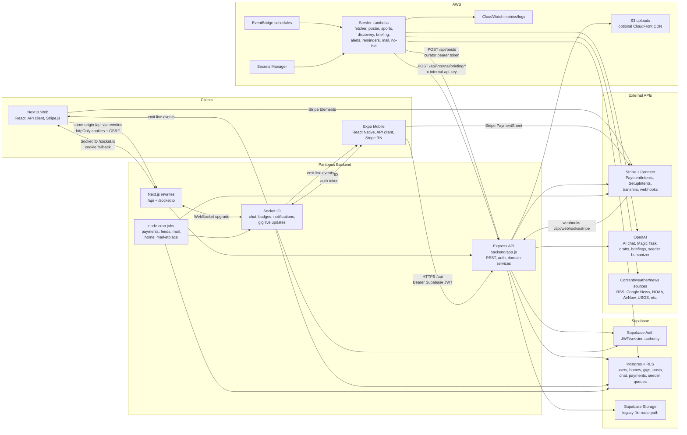

# Core Product Architecture

Use this file in GitHub or a Markdown preview that supports Mermaid.

```mermaid
flowchart LR
  subgraph C["Clients"]
    Web["Next.js Web<br/>React, API client, Stripe.js"]
    Mobile["Expo Mobile<br/>React Native, API client, Stripe RN"]
  end

  subgraph B["Pantopus Backend"]
    NextProxy["Next.js rewrites<br/>/api + /socket.io"]
    API["Express API<br/>backend/app.js<br/>REST, auth, domain services"]
    SIO["Socket.IO<br/>chat, badges, notifications,<br/>gig live updates"]
    Cron["node-cron jobs<br/>payments, feeds, mail,<br/>home, marketplace"]
  end

  subgraph D["Supabase"]
    Auth["Supabase Auth<br/>JWT/session authority"]
    DB["Postgres + RLS<br/>users, homes, gigs, posts,<br/>chat, payments, seeder queues"]
    StorageLegacy["Supabase Storage<br/>legacy file route path"]
  end

  subgraph AWS["AWS"]
    S3["S3 uploads<br/>optional CloudFront CDN"]
    EventBridge["EventBridge schedules"]
    Secrets["Secrets Manager"]
    Lambdas["Seeder Lambdas<br/>fetcher, poster, sports,<br/>discovery, briefing,<br/>alerts, reminders, mail, no-bid"]
    CloudWatch["CloudWatch metrics/logs"]
  end

  subgraph EXT["External APIs"]
    Stripe["Stripe + Connect<br/>PaymentIntents, SetupIntents,<br/>transfers, webhooks"]
    OpenAI["OpenAI<br/>AI chat, Magic Task,<br/>drafts, briefings, seeder humanizer"]
    Sources["Content/weather/news sources<br/>RSS, Google News, NOAA,<br/>AirNow, USGS, etc."]
  end

  Web -->|"same-origin /api via rewrites<br/>httpOnly cookies + CSRF"| NextProxy
  NextProxy --> API
  Web <-->|"Socket.IO /socket.io<br/>cookie fallback"| NextProxy
  NextProxy <-->|"WebSocket upgrade"| SIO

  Mobile -->|"HTTPS /api<br/>Bearer Supabase JWT"| API
  Mobile <-->|"Socket.IO<br/>auth token"| SIO

  Web -->|"Stripe Elements"| Stripe
  Mobile -->|"Stripe PaymentSheet"| Stripe

  API --> Auth
  API --> DB
  API --> S3
  API --> StorageLegacy
  API --> OpenAI
  API --> Stripe
  Stripe -->|"webhooks /api/webhooks/stripe"| API

  SIO --> Auth
  SIO --> DB
  SIO -->|"emit live events"| Web
  SIO -->|"emit live events"| Mobile

  Cron --> DB
  Cron --> Stripe
  Cron --> SIO

  EventBridge --> Lambdas
  Secrets --> Lambdas
  Lambdas --> DB
  Lambdas --> OpenAI
  Lambdas --> Sources
  Lambdas -->|"POST /api/posts<br/>curator bearer token"| API
  Lambdas -->|"POST /api/internal/briefing/*<br/>x-internal-api-key"| API
  Lambdas --> CloudWatch
```
