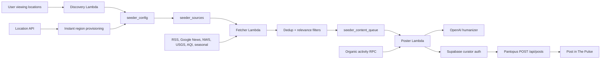

# Seeder Lambda Pipeline Interview Guide

This guide is written as a data-engineering interview answer for the Pantopus seeder pipeline. It explains the pipeline from source discovery through queueing and posting, then expands into idempotency, quality, humanization, credentials, cadence control, observability, safety, runtime drift, and test strategy.

The implementation source of truth is the code and schema, especially:

- `pantopus-seeder/src/handlers/fetcher.py`
- `pantopus-seeder/src/handlers/poster.py`
- `pantopus-seeder/src/pipeline/dedup.py`
- `pantopus-seeder/src/pipeline/topic_dedup.py`
- `pantopus-seeder/src/pipeline/relevance_filter.py`
- `pantopus-seeder/src/pipeline/humanizer.py`
- `pantopus-seeder/src/pipeline/poster.py`
- `pantopus-seeder/src/tapering/density_checker.py`
- `pantopus-seeder/src/config/region_registry.py`
- `pantopus-seeder/deploy/template.yaml`
- `supabase/migrations/20260404000001_seeder_curator_account_tables.sql`
- `backend/services/seederProvisioningService.js`

## Executive Summary

The seeder is a serverless content ingestion and posting pipeline. Its job is to keep local feeds useful during cold start without drowning out organic community activity.

At a high level:

1. Regions and sources are discovered or provisioned into database tables.
2. The fetcher Lambda periodically pulls content from source adapters.
3. The fetcher deduplicates, filters, and writes rows into `seeder_content_queue`.
4. The poster Lambda wakes during posting windows, checks region density, chooses the best queued item, humanizes it with OpenAI, signs in as the curator account, and posts through the normal Pantopus API.
5. Queue status, CloudWatch metrics, and database counts make the pipeline observable.
6. Quality and safety are mostly deterministic and database-backed. OpenAI is used for rewriting and one extra quality gate, not as the source of truth.

The central design idea is that every external or model-driven step is bounded by deterministic gates and persisted state. The database owns the durable workflow state.

## Pipeline Walkthrough: Source Discovery To Queue To Post

### 1. Region Discovery And Provisioning

The seeder does not hardcode active regions in the Lambda path. Active regions are loaded from `seeder_config`, and active sources for each region are loaded from `seeder_sources`.

There are three ways a region can be created:

1. Manual setup via `pantopus-seeder/scripts/setup_curator_account.py`.
2. Daily Discovery Lambda via `pantopus-seeder/src/handlers/discovery.py`.
3. Instant provisioning from the backend when a user sets a viewing location outside existing region coverage, via `backend/services/seederProvisioningService.js`.

The daily Discovery Lambda works like this:

1. Load all active regions from `seeder_config`.
2. Load user viewing locations from `UserViewingLocation`.
3. Filter out users already inside an existing region radius.
4. Cluster uncovered users with a grid-cell algorithm.
5. Promote dense clusters above the threshold, defaulting to 5 users.
6. Reject candidates too close to existing regions or other candidates.
7. Reverse-geocode the candidate center with Nominatim.
8. Derive an IANA timezone from coordinates.
9. Upsert one `seeder_config` row.
10. Upsert starter P1 and P2 sources in `seeder_sources`.

Instant provisioning is intentionally lighter weight. When a user changes viewing location, the backend checks whether any active seeder region covers the coordinates. If not, it fire-and-forgets region creation. It creates a region with P1 and P2 sources so the next fetcher run can seed useful local content for even a single new market.

Default newly provisioned source mix:

| Priority | Meaning | Active By Default | Examples |
|---|---:|---:|---|
| P1 | Critical | Yes | NWS alerts, USGS earthquakes |
| P2 | Core | Yes | Google News local query, seasonal tips |
| P3 | Enrichment | Usually no for new manual regions, sometimes active in mature configured regions | sports, transit, community resources, air quality |
| P4 | Filler | No | On This Day, lightweight extras |

### 2. Source Loading

The fetcher uses `load_active_regions()` and `load_sources_for_region()` from `region_registry.py`.

Each source row is converted into a source adapter by `get_sources_from_db()`:

- `rss` -> `RssSource`
- `google_news` -> `GoogleNewsSource`
- `nws_alerts` -> `NwsAlertsSource`
- `air_quality` -> `AirQualitySource`
- `usgs_earthquakes` -> `UsgsEarthquakeSource`
- `on_this_day` -> `OnThisDaySource`
- `seasonal` -> `SeasonalSource`

The important data-engineering principle is that adding or disabling a source is a data change, not a code deployment. Operators can update `seeder_sources` and the next fetcher invocation sees it.

### 3. Fetcher Lambda

The fetcher is scheduled by EventBridge every 2 hours.

For each active region:

1. Load source configs.
2. Instantiate source adapters.
3. Load recent topic token sets for topic-level dedup.
4. Fetch each source.
5. For every raw item:
   - Compute a stable `dedup_hash`.
   - Check if that hash already exists in an active queue state.
   - Run topic-level Jaccard dedup against recent queued/humanized/posted items.
   - Run deterministic relevance filters.
   - Insert a row into `seeder_content_queue` as `queued` or `filtered_out`.
6. Run queue hygiene:
   - Purge old `filtered_out` and `skipped` rows after 7 days.
   - Purge old `posted` rows after 30 days.
   - Mark stale `queued` rows as `skipped`, using category-specific stale windows.
7. Publish `SeederQueueDepth` to CloudWatch.

The fetcher summary includes:

- `regions_processed`
- `total_queued`
- `total_filtered`
- `total_deduped`
- `total_errors`
- `queue_depth`

### 4. Queue State Machine

`seeder_content_queue` is the durable pipeline state table.

Important columns:

| Column | Purpose |
|---|---|
| `source` | Source ID, such as `rss:columbian` or `google_news:clark_county` |
| `source_url` | Original article or source URL |
| `raw_title` | Source title |
| `raw_body` | Source body or summary |
| `region` | Target seeder region |
| `category` | Pipeline category, such as `local_news`, `weather`, `sports` |
| `status` | `queued`, `filtered_out`, `humanized`, `posted`, `skipped`, `failed` |
| `humanized_text` | OpenAI output after rewrite |
| `post_id` | Pantopus `Post` ID after success |
| `dedup_hash` | Stable content hash |
| `failure_reason` | Deterministic or runtime reason for rejection/failure |
| `media_urls` / `media_types` | Optional media carried through to the post API |
| `source_priority` | P1-P4 source priority used by the poster scorer |

That table is the backbone of idempotency, quality auditability, debugging, and operator intervention.

### 5. Poster Lambda

The poster is scheduled hourly during the broad UTC range that covers Pacific posting hours. The Lambda then self-selects the actual slot.

The flow:

1. Determine the current Pacific hour.
2. Match it to `morning`, `midday`, or `evening` using +/- 1 hour tolerance.
3. Skip Sunday.
4. On Saturday, only allow the morning slot.
5. Apply random jitter of 0 to 5 minutes.
6. Load secrets, Supabase client, and active regions.
7. For each region:
   - Query organic activity through `get_seeder_tapering_metrics`.
   - Determine tapering stage.
   - Check whether this stage allows the current slot.
   - Load allowed categories for the stage.
   - Select and score queued candidates.
   - Humanize the selected candidate with OpenAI.
   - Mark the queue item `humanized`.
   - Authenticate as the curator through Supabase Auth.
   - Call Pantopus `POST /api/posts`.
   - Mark the item `posted` with `post_id`, or `failed` with a reason.

The post is created through the same backend API path a user post uses. That is intentional: the feed, visibility, link previews, media handling, and downstream post processing remain centralized in the product backend.

## Question 1: Explain The Seeder Lambda Pipeline From Source Discovery To Queue To Post

Interview answer:

The seeder is a scheduled, database-driven Lambda pipeline. Region and source discovery are data-backed, not hardcoded. `seeder_config` owns the active regions, and `seeder_sources` owns the source catalog for each region. Regions can be provisioned manually, by daily clustering over `UserViewingLocation`, or instantly from the backend when a user sets a location outside existing coverage.

The fetcher runs every 2 hours. It loads each active region, loads active sources for that region, instantiates source adapters, fetches raw items, computes a dedup hash, runs deterministic quality and locality filters, and inserts rows into `seeder_content_queue`. Rows that pass become `queued`; rejected rows become `filtered_out` with a reason.

The poster runs hourly across a broad UTC schedule but self-selects local Pacific posting slots. It skips non-slot hours, applies weekend rules and jitter, checks organic activity to determine tapering stage, picks a ranked queue item, humanizes it through OpenAI, authenticates as the curator, posts through `/api/posts`, and updates the queue state.

The pipeline is event scheduled but stateful through Postgres. Lambdas are stateless; Supabase/Postgres is the workflow ledger.

Architecture diagram:



## Question 2: How Do You Avoid Duplicate Queue Inserts Under Concurrent Fetchers?

There are multiple layers.

### Hash-Based Dedup

For every raw item, the fetcher computes:

```text
SHA-256(source_id | source_url_or_title | published_date)
```

If `source_url` exists, it is the identifier. Otherwise, the title is used. The date is the published date if present, otherwise today's UTC date.

Before insertion, the fetcher checks:

```text
seeder_content_queue
where dedup_hash = ?
and status not in ('filtered_out', 'skipped')
```

Rows in rejected terminal states do not block future ingestion, but rows that are queued, humanized, posted, or failed are considered active enough to prevent duplicates.

### Database Unique Index

The application-level check prevents ordinary duplicate work, but it is not the concurrency guarantee. The actual guarantee is the partial unique index created in the migration:

```sql
CREATE UNIQUE INDEX idx_seeder_queue_dedup
  ON "public"."seeder_content_queue" ("dedup_hash")
  WHERE "status" NOT IN ('filtered_out', 'skipped');
```

That means two fetchers can race like this:

1. Fetcher A checks for hash `H`; sees no row.
2. Fetcher B checks for hash `H`; sees no row.
3. Fetcher A inserts successfully.
4. Fetcher B attempts insert and Postgres rejects it.

The invariant is still safe because Postgres serializes the uniqueness rule.

### Topic-Level Dedup

URL/hash dedup only catches the exact same source item. The pipeline also loads recent queued, humanized, and posted items for the region, normalizes title/body tokens, and compares Jaccard similarity. If a different outlet retells the same local story, it can be skipped before insertion.

This catches:

- same event, different URL
- syndicated reposts
- Google News duplicates from multiple publishers
- title rewrites around the same story

### In-Run Dedup

After an item is queued, the fetcher appends its normalized token set to the in-memory recent topic list. That prevents later sources in the same invocation from queueing a near-duplicate story.

### Honest Limitation And Improvement

The current insert path catches any insert exception in the item-level `except` block and increments `errors`. If a concurrent insert causes a duplicate-key exception, the database invariant is safe, but the metric would count it as an error rather than `deduped`.

The improvement is straightforward:

- detect Postgres code `23505` or Supabase duplicate-key messages on insert
- increment `deduped`
- continue without logging it as a pipeline error

That would make metrics cleaner without changing the correctness model.

## Question 3: What Is The Source Of Truth For Content Quality?

The source of truth is not OpenAI. The source of truth is the deterministic pipeline policy plus the persisted queue state.

Quality is represented by:

- code-defined filter rules in `relevance_filter.py`
- source definitions and priorities in `seeder_sources`
- region metadata in `seeder_config`
- queue status and `failure_reason` in `seeder_content_queue`
- post-success linkage through `post_id`

OpenAI can return `SKIP`, but that is treated as another quality signal, not the only authority.

The deterministic filters check:

- blocklisted crime/violence terms
- partisan and polarizing-policy terms
- paywall and obituary terms
- freshness windows
- minimum title/body quality
- all-caps titles
- generic listing content
- URL-like or asset-like titles
- low-signal sports content, especially betting/fantasy/thread spam
- Clark County WA geo correctness
- seasonal timing validity

The queue stores the result. That matters because data engineers need auditability. If an item is rejected, we can inspect `failure_reason`. If an item fails after OpenAI or posting, we can inspect whether it was `failed`, `skipped`, `humanized`, or `posted`.

In an interview I would phrase it like this:

The quality source of truth is the persisted decision record in `seeder_content_queue`, produced by deterministic policy code. OpenAI participates only after a row has passed deterministic gates, and its output is validated again before posting.

## Question 4: How Does OpenAI Humanization Avoid Hallucinating Local Facts?

The model is deliberately boxed in.

### Grounded Input Only

The humanizer receives:

- category
- region display name
- current date
- current PNW seasonal context when relevant
- raw title
- raw body
- source URL
- source display name

It is not asked to browse, infer extra facts, or enrich the article from memory.

### Prompt Rules

The humanizer prompt explicitly says:

- reject content that is not useful or local
- reject generic national/international items with no local angle
- reject content about a city or region far away
- include specific details from the source
- do not editorialize
- do not add information not present in the source
- include source attribution for non-sports posts

Sports has a separate prompt because national sports content should not be rejected for lacking a local angle.

### Deterministic Locality Comes Before The Model

The strongest anti-hallucination control is that locality is validated before OpenAI.

Examples:

- `seeder_config` supplies the intended region and display name.
- source IDs and source display names come from curated data.
- Clark County WA has a positive geo gate. If an item mentions Clark County, untrusted sources must prove it is about Southwest Washington, not Nevada, Kentucky, Wisconsin, or another Clark County.
- known local sources such as The Columbian can be trusted differently from broad Google News.
- NWS, USGS, air quality, and seasonal sources are coordinate- or code-backed.

### Output Validation

After the model returns text, the pipeline rejects:

- empty text
- text over `MAX_HUMANIZED_LENGTH`
- too many exclamation marks
- greeting prefixes
- first-person singular phrasing
- "no content available" style placeholders
- stale seasonal calendar windows

If validation fails, the humanizer retries once with corrective feedback. If it still fails, the item is marked failed or skipped.

### Interview Summary

OpenAI is used as a constrained rewrite engine. Local fact truth comes from source adapters, source metadata, region metadata, deterministic filters, and date/geo checks. The model can only transform a bounded payload, and the output must pass validators before it can become a post.

## Question 5: How Are Curator Credentials Protected?

Curator credentials and other runtime secrets live in AWS Secrets Manager. The secret name is:

```text
pantopus/seeder/{environment}
```

The Lambda environment contains the secret name, not the secret values.

Secret fields include:

- `SUPABASE_URL`
- `SUPABASE_SERVICE_ROLE_KEY`
- `PANTOPUS_API_BASE_URL`
- `CURATOR_EMAIL`
- `CURATOR_PASSWORD`
- `OPENAI_API_KEY`
- `INTERNAL_API_KEY` for internal notification endpoints
- optional weather credentials

The SAM template grants each Lambda `secretsmanager:GetSecretValue` on the specific `SeederSecret`. It also retains the Secrets Manager secret across stack updates and deletion behavior so CloudFormation does not overwrite live credential contents during deploys.

The poster does not directly write posts with the service role. Instead:

1. The Lambda loads `CURATOR_EMAIL` and `CURATOR_PASSWORD`.
2. It signs in through Supabase Auth.
3. It receives a Supabase access token for the curator account.
4. It sends `Authorization: Bearer <token>` to `/api/posts`.

That is better than bypassing the application API because post validation, media handling, feed hooks, and downstream behavior stay centralized.

Security notes:

- The service role key is powerful and should remain Lambda-only.
- RLS policies for seeder tables are service-role only.
- Local `.env` usage is development fallback only.
- The current poster logs an access-token prefix. It is not the password, but I would remove or redact that log line as a hardening change.

## Question 6: How Do Posting Windows, Jitter, And Density Tapering Work?

### EventBridge Schedule

The poster schedule in SAM is:

```text
cron(0 14-23,0-1 * * ? *)
```

That runs hourly across the UTC hours that cover Pacific posting windows regardless of daylight saving time. The Lambda itself decides whether to post.

### Slot Detection

Configured Pacific slots:

| Slot | Pacific Hour |
|---|---:|
| morning | 7 |
| midday | 12 |
| evening | 17 |

The poster accepts a +/- 1 hour tolerance. For example, 7 or 8 PT can match morning.

Weekend rules:

- Sunday: no seeded posts.
- Saturday: morning only.
- Weekdays: morning, midday, evening, subject to tapering.

The Lambda supports a `force` event for manual testing, which bypasses slot and weekend restrictions and skips jitter.

### Jitter

For normal scheduled execution, the poster sleeps a random 0 to 5 minutes:

```text
random.randint(0, MAX_JITTER_MINUTES * 60)
```

This avoids every region posting at exactly the same second and makes the seeded content feel less mechanical. It also smooths load on the downstream API and auth path.

### Density Tapering

Before selecting content for a region, the poster calls `check_density()`. That runs the `get_seeder_tapering_metrics` RPC with the region center and radius.

The RPC counts non-curator organic activity in the last 7 days:

- average organic posts per day
- distinct active non-curator posters

The default thresholds in code are:

| Stage | Trigger |
|---|---|
| full | below reduced thresholds |
| reduced | `avg_daily_posts >= 2` or `active_posters >= 10` |
| minimal | `avg_daily_posts >= 5` or `active_posters >= 15` |
| dormant | `avg_daily_posts >= 10` or `active_posters >= 20` |

Stages are evaluated from most restrictive to least restrictive: dormant, then minimal, then reduced, then full.

Stage behavior:

| Stage | Slots | Categories |
|---|---|---|
| full | morning, midday, evening | all |
| reduced | morning, evening | all |
| minimal | morning only | event, weather, seasonal, safety, air quality, earthquake |
| dormant | none | effectively no seeded posting; only critical categories remain configured as allowed |

The point is to seed aggressively only when the region is cold. As the local graph becomes active, seeded content tapers down.

### Candidate Scoring

The poster scores queued items with source priority as the primary signal:

- P1 -> critical safety/weather/earthquake
- P2 -> core local news/events/seasonal
- P3 -> enrichment such as community resources and sports
- P4 -> filler

Then it adds category and diversity bonuses:

- safety/weather/earthquake bonus
- event bonus
- seasonal bonus, but seasonal is capped if a seasonal item posted recently
- source diversity bonus
- category rotation bonus
- enrichment bonus to break core-news monotony
- local game-day sports boost, but still below P1 alerts

The evening slot has special enrichment behavior. If enrichment categories are allowed, enrichment exists, and no P1 alert is waiting, evening can prefer sports/community resources. If the P1 lookup fails, it fails closed and assumes an alert exists, preserving safety priority.

## Question 7: What Metrics Tell You The Pipeline Is Healthy?

### Core Seeder Metrics

The fetcher publishes:

- `Pantopus/Seeder/{env}::SeederQueueDepth`

That single metric is high leverage:

- Queue depth near zero for too long means sources are broken, filters are too strict, regions have no active sources, or fetcher is failing.
- Queue depth growing without drain means the poster is failing, out of slot, failing auth, failing OpenAI, or the API is rejecting posts.

### Handler Return Stats

Fetcher:

- regions processed
- total queued
- total filtered
- total deduped
- total errors
- queue depth

Poster:

- regions processed
- items posted
- items failed
- items skipped
- tapering stage by region

Sports lane:

- active events processed
- queued
- deduped
- filtered
- errors
- posts sent
- skipped by cap
- skipped by organic dedup
- posts failed

### Database Health Queries

The best operational dashboard should query:

```sql
SELECT status, COUNT(*)
FROM seeder_content_queue
GROUP BY status;
```

Useful slices:

- queued count by region and category
- oldest queued item age
- failed count by `failure_reason`
- filtered count by `failure_reason`
- posted count per region per day
- OpenAI validation failures over time
- API rejection/server errors over time
- stale rows marked skipped
- duplicate-key incidents, if we add explicit handling

### CloudWatch Lambda Metrics

For every Lambda:

- `Errors`
- `Duration`
- `Timeouts`
- `Throttles`
- concurrent executions
- iterator age is not relevant because these are not stream consumers

For the poster specifically, `Duration` matters because jitter plus OpenAI plus API calls can approach timeout if dependencies slow down.

### Adjacent Notification Metrics

The same Lambda package also includes briefing, alert, reminder, mail, no-bid, and sports jobs. Existing custom metric namespaces include:

- `Pantopus/Briefing/{env}`:
  - `BriefingEligibleUsers`
  - `BriefingSent`
  - `BriefingSkipped`
  - `BriefingFailed`
  - `BriefingLatencyMs`
- `Pantopus/Alerts/{env}`:
  - `AlertGeohashesChecked`
  - `WeatherAlertsFound`
  - `AqiAlertsFound`
  - `UsersNotified`
  - `WeatherKitFallbacks`
  - `AlertCheckerLatencyMs`
- `Pantopus/Reminders/{env}`:
  - `BillsNotified`
  - `TasksNotified`
  - `CalendarNotified`
  - `ReminderErrors`
  - `ReminderLatencyMs`
- `Pantopus/MailNotifications/{env}`:
  - `UrgentMailSent`
  - `SummarySent`
  - `MailNotifSkipped`
  - `MailNotifErrors`
  - `MailNotifLatencyMs`
- `Pantopus/NoBidNudge/{env}`:
  - `GigsChecked`
  - `NudgesSent`
  - `NudgeErrors`
  - `NudgeLatencyMs`

### Healthy Pipeline Pattern

In production, I want to see:

- fetcher succeeds every 2 hours
- nonzero but bounded queue depth
- poster posts during allowed windows when stage permits
- filtered count is nonzero, proving quality gates are active
- deduped count is nonzero for noisy sources like Google News
- failed rows are rare and mostly explainable
- stale queue rows do not accumulate
- tapering shifts regions down as organic activity grows
- no repeated curator auth failures
- no persistent OpenAI/API failure reasons

## Question 8: How Do You Prevent Spammy Or Biased Local Content?

The pipeline prevents spam and bias through source curation, deterministic filtering, category priority, tapering, and model validation.

### Source Curation

Sources are explicitly configured. New regions start with a conservative source mix:

- weather alerts
- earthquake alerts
- Google News local search
- seasonal tips

P3/P4 enrichment can be disabled by default. That prevents a new empty market from being flooded with sports, trivia, or weak community content.

### Query Shaping

Google News queries include negative terms for known low-quality content:

- `-odds`
- `-betting`
- `-fantasy`
- `-player props`
- `-DraftKings`
- `-FanDuel`

Clark County queries are anchored to Washington and nearby localities to avoid other Clark Counties.

### Relevance Filter

The filter blocks:

- crime and violence terms
- political/partisan terms
- paywalled content
- obituaries
- reproductive-policy fights
- immigration-enforcement fights
- LGBTQ policy advocacy fights when paired with advocacy/litigation/policy framing
- stale content
- all-caps titles
- thin content
- generic listings
- betting/fantasy sports
- thread-like sports spam

The goal is not to decide which side of a dispute is right. The goal is to keep seeded content practical, local, and low-regret.

### Positive Locality

For ambiguous geographies, the filter requires positive anchors. Clark County is the clearest example: broad Google News often returns Clark County NV, KY, WI, and other jurisdictions. The pipeline rejects those unless there is a strong Southwest Washington anchor.

### Priority And Tapering

Even if spammy enrichment slips through a source, it competes below safety/weather and core local news. As organic activity grows, the seeder posts less often. That prevents a platform bot from dominating the feed.

### Humanizer Guardrails

OpenAI is instructed to return `SKIP` for:

- spam
- clickbait
- content with no local utility
- national content with no local angle for local lane
- low-effort listings
- far-away region mismatch

The output is also validated for tone and format before posting.

### Auditability

Rejected content is not invisible. It is stored as `filtered_out` with `failure_reason`, so operators can tune filters based on evidence rather than guesswork.

## Question 9: Why Does SAM Use Python 3.13 While Some Docs Mention 3.12?

The SAM template is the deployment source of truth. It currently sets:

```yaml
Globals:
  Function:
    Runtime: python3.13
    Architectures:
      - arm64
```

Some older docs mention Python 3.12 because they were written before the runtime was bumped. Those docs are stale. The more recent cron/Lambda design doc correctly says Python 3.13.

The build script also reflects the current deployment approach:

1. Copy source into `pantopus-seeder/build`.
2. Copy `requirements-lambda.txt` to `build/requirements.txt`.
3. Run tests.
4. Deploy with `sam build --use-container`.

Using `--use-container` matters because dependencies such as Pydantic and Supabase transitive dependencies should be built/resolved against the Lambda Linux arm64 environment, not just the developer's local machine.

Interview framing:

I would say the active infrastructure is Python 3.13. Any 3.12 references are documentation drift. I treat IaC as authoritative for runtime, and I would clean up the old docs to avoid operator confusion.

Related drift to be aware of:

- Older docs mention `gpt-4o-mini` or `gpt-5-mini`.
- The current code sets `HUMANIZER_MODEL = "gpt-5.4-mini"`.
- For interview and operations, the implementation should be considered authoritative unless intentionally changed.

## Question 10: How Do You Test EventBridge Schedules And Lambda Retries?

Testing is split into unit tests, template validation, manual invocation, and production observability.

### Unit Test Schedule Logic

The poster does not blindly trust EventBridge timing. It has internal slot detection, so we can unit test it deterministically.

Existing tests cover:

- morning slot detection
- midday slot detection
- evening slot detection
- no matching slot
- Sunday skip
- Saturday midday skip
- Saturday morning allowed
- tapering suppressing a slot
- jitter mocked out with `time.sleep`
- random jitter mocked with `random.randint`

This is the right place to test business logic because EventBridge only invokes; it does not understand our product cadence.

### Force Mode

The poster supports an event payload:

```json
{"force": true}
```

That lets operators manually invoke the Lambda outside a real slot. Force mode selects morning, bypasses weekend rules, and skips jitter. That is useful for smoke tests after deploy.

### Template Validation

For the SAM/EventBridge layer, I would test at the IaC level:

```bash
cd pantopus-seeder/deploy
sam validate
sam build --use-container
```

Then inspect the generated CloudFormation or deploy to dev/staging and verify the schedule rules exist with the expected names:

- `pantopus-seeder-fetch-{env}`
- `pantopus-seeder-post-{env}`
- `pantopus-seeder-discovery-{env}`
- sports fetch/post schedules
- briefing/alert/reminder/mail/no-bid schedules

### Manual Lambda Invocation

Fetcher smoke test:

```bash
aws lambda invoke \
  --function-name pantopus-seeder-fetcher-dev \
  --payload '{}' \
  --region us-west-2 \
  /tmp/fetcher-response.json
```

Poster smoke test:

```bash
aws lambda invoke \
  --function-name pantopus-seeder-poster-dev \
  --payload '{"force": true}' \
  --region us-west-2 \
  /tmp/poster-response.json
```

The expected result is not necessarily a post every time. The expected result is explainable state: queued, skipped because no item, skipped by tapering, posted, or failed with a clear reason.

### Retry And Idempotency Tests

For retries, the main test strategy is idempotency:

- Fetcher retries are safe because `dedup_hash` is DB-unique for active rows.
- Poster retries are bounded by queue status transitions.
- Curator auth failure resets the item back to `queued`, so it can be retried.
- Post API failure marks the item `failed` with `failure_reason`.
- AI quality gate marks low-value items `skipped`.
- Briefing cleanup retries failed daily briefings once and prefixes failures with `[RETRY]` to avoid infinite retry loops.

Existing briefing cleanup tests cover:

- retry date candidates across timezones
- purging old `DailyBriefingDelivery` rows
- purging expired `ContextCache` rows
- retrying failed deliveries through `/api/internal/briefing/send`
- using the `[RETRY]` marker to prevent retry loops

### Lambda Runtime Retry Semantics

EventBridge invokes Lambdas asynchronously and AWS has its own retry behavior for failed async invocations. The code is designed so re-entry is safe:

- fetcher duplicate inserts are blocked by the database
- notification history tables dedupe alerts/reminders/mail
- briefing delivery rows dedupe daily briefings
- queue statuses prevent accidental repeat posting paths

However, the current SAM template does not define explicit DLQs or custom retry policies for every scheduled Lambda. For a stricter production setup, I would add:

- per-Lambda dead-letter queues or async destinations
- explicit max retry attempts where appropriate
- alarms on DLQ depth
- alarms on Lambda errors and timeouts
- a dashboard that correlates Lambda errors with queue `failed` rows

That would make failure recovery more operationally transparent.

## End-To-End Data Contract

The most important data contracts:

### `seeder_config`

Owns active regions:

- `region`
- `curator_user_id`
- `active`
- `lat`
- `lng`
- `radius_meters`
- `timezone`
- `display_name`
- `tapering_thresholds`
- `provisioned_by`

### `seeder_sources`

Owns source catalog:

- `source_id`
- `source_type`
- `url`
- `category`
- `display_name`
- `region`
- `active`
- `priority`

### `seeder_content_queue`

Owns workflow state:

- raw source fields
- queue status
- dedup hash
- humanized text
- post ID
- failure reason
- media arrays
- priority
- sports-specific scope/event fields where present

### `Post`

Owns final user-visible content after the backend API accepts the post.

## Failure Modes And How The Pipeline Responds

| Failure | Behavior |
|---|---|
| Secrets missing or invalid | Handler returns `secrets_load_failed` |
| Supabase client init fails | Handler returns `supabase_init_failed` |
| Source fetch fails | Source error counted; other sources continue |
| Source returns partial error | Error counted; returned items can still process |
| Duplicate item | Skipped before insert, or DB unique index rejects race |
| Low-quality item | Inserted as `filtered_out` or marked `skipped` |
| OpenAI package missing | Humanizer returns API error |
| OpenAI API error | Queue row marked `failed` |
| OpenAI returns `SKIP` | Queue row marked `skipped`; poster tries next candidate |
| Humanizer output invalid | Retry once, then `failed` |
| Curator auth fails | Item reset to `queued` for later retry |
| Post API 4xx | Item marked `failed` with API rejection reason |
| Post API 5xx | Item marked `failed` with server error reason |
| Queue items age out | Fetcher marks stale `queued` rows as `skipped` |

## Interview-Ready Deep Answer

If I had to answer the whole system in one pass:

The seeder is a stateless Lambda layer over a stateful Postgres workflow. Source and region configuration live in the database, not in code, so the system can expand regions and source mixes without redeploying. The fetcher is a producer: it loads active regions, fetches source adapters, deduplicates at both exact-hash and topic-similarity levels, runs deterministic quality filters, writes all decisions into `seeder_content_queue`, and emits queue depth metrics. The poster is a consumer: it wakes during broad EventBridge hours, self-selects valid local slots, applies weekend/jitter rules, checks organic density to taper down seeded cadence, ranks queued content by priority and diversity, humanizes with a constrained OpenAI prompt, posts through the normal Pantopus API as a curator, and persists the final queue status.

Idempotency is primarily database-enforced. The dedup hash prevents repeated active queue rows, and the partial unique index is the actual concurrency guard when two fetchers race. Other pipelines follow the same pattern: alert history dedupes notifications, briefing delivery rows dedupe daily sends, and queue status transitions make poster retries explainable.

Quality is not outsourced to the LLM. The deterministic code and persisted queue decisions are the source of truth. The model can reject or rewrite, but it cannot discover local facts. The local facts come from configured sources, coordinates, region display names, source names, source URLs, and pre-model geo/freshness/policy filters. The humanizer output is validated before posting.

Operationally, I watch queue depth, status distribution, failure reasons, Lambda errors/duration/timeouts, fetcher queued/filtered/deduped counts, poster posted/failed/skipped counts, and tapering stages. A healthy system has a nonzero but bounded queue, regular successful fetches, posts only in allowed windows, nonzero filter/dedup activity, low failure rates, and a visible taper from full to reduced/minimal/dormant as organic users take over.

## Follow-Up Improvements I Would Volunteer In An Interview

1. Treat DB duplicate-key insert races as `deduped` instead of generic errors.
2. Add explicit EventBridge retry policy and DLQ/async destination per scheduled Lambda.
3. Remove token-prefix logging from poster.
4. Add CloudWatch custom metrics for poster results, not only fetcher queue depth.
5. Add a queue age metric, such as oldest queued item per region.
6. Add a dashboard for `failure_reason` top-N trends.
7. Add an integration test against a local or staging Postgres unique index to prove concurrent insert behavior.
8. Add SAM template tests that parse schedule expressions and assert expected rules.
9. Clean up stale docs that still mention Python 3.12 or older OpenAI model names.
10. Add operator runbooks for stuck queue, zero queue, auth failures, and OpenAI outage modes.

