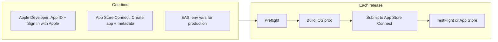

# iOS Release Readiness and Build/Release Guide

This guide covers whether the Pantopus mobile app is ready for iOS release and gives step-by-step instructions to build and release on iOS (TestFlight and App Store).

## Part 1: Is the repo ready for iOS release?

### What's already in place

- **Expo / EAS**
  - `frontend/apps/mobile/app.json`: `bundleIdentifier` `com.pantopus.app`, `usesAppleSignIn: true`, iOS permissions (camera, photos, location), privacy manifest (expo-build-properties), Stripe `merchantIdentifier`, app icon and splash.
  - `frontend/apps/mobile/app.config.js`: Env-based `IOS_BUILD_NUMBER`, production ATS (no arbitrary loads), Google Maps API key wiring, `EAS_PROJECT_ID` from env or base config.
  - `frontend/apps/mobile/eas.json`: Build profiles `development`, `preview`, `production` with iOS (simulator: false for preview/prod); `autoIncrement` for production. iOS submit profile under `submit.production.ios` with `ascAppId` (replace `0` with your App Store Connect Apple ID).
  - `frontend/apps/mobile/package.json`: Scripts `build:ios:dev`, `build:ios:preview`, `build:ios:prod`, `submit:ios:prod`; Expo SDK ~54, React Native 0.81.5.
  - EAS project id is set in `app.json` → `extra.eas.projectId`.
  - `frontend/apps/mobile/scripts/release-preflight.mjs`: Validates production config (bundle ID, Apple Sign In, build number, EAS project id, ATS, plugins, eas.json profiles, no placeholders), runs `expo install --check`, `expo-doctor`, and `tsc --noEmit`.
  - `frontend/apps/mobile/README.release.md`: One-time setup, EAS env vars, preflight, build/submit commands, and Apple/App Store Connect checklist.
  - Assets: `frontend/apps/mobile/assets/icon.png` and `adaptive-icon.png` present.
  - API config: `frontend/apps/mobile/src/config/api.ts` requires `EXPO_PUBLIC_API_URL` with `https` in production and uses `expo-secure-store` for tokens.
  - Maps: `docs/maps-key-restrictions.md` documents restricting Google Maps key to iOS bundle ID `com.pantopus.app`.

### Gaps / things to do before release

| Item | Notes |
|------|--------|
| **EAS environment variables** | Not in repo (by design). Set in EAS dashboard for `preview` and `production`: `APP_ENV`, `EXPO_PUBLIC_API_URL`, `EXPO_PUBLIC_STRIPE_PUBLISHABLE_KEY`, `EXPO_PUBLIC_GOOGLE_MAPS_API_KEY`. See `frontend/apps/mobile/README.release.md`. |
| **Apple Developer Program** | Paid account required. One-time: create App ID `com.pantopus.app`, enable "Sign In with Apple". EAS can manage certs/provisioning. |
| **App Store Connect app** | One-time: create app, bundle ID `com.pantopus.app`, fill metadata (name, privacy policy URL, category, etc.) and screenshots for review. |
| **ascAppId in eas.json** | In `frontend/apps/mobile/eas.json`, `submit.production.ios.ascAppId` is set to `0` as a placeholder. Replace with your App Store Connect app's numeric Apple ID for non-interactive submit. |
| **Replace placeholders** | Ensure EAS production env has real `EXPO_PUBLIC_*` values (API URL, Stripe live key, Google Maps key restricted to `com.pantopus.app`). |
| **CI** | `.github/workflows/ci.yml` runs mobile-checks (expo install --check, tsc, Android export only). No iOS export or EAS build in CI; add if you want automated iOS builds. |

**Verdict:** The repo is **ready for iOS release** once: (1) EAS env vars are set for production, (2) Apple Developer and App Store Connect one-time setup is done, (3) you replace `ascAppId` in `eas.json` with your App Store Connect app's Apple ID (if you want non-interactive submit), and (4) you run the preflight script and fix any failures.

---

## Part 2: Step-by-step build and release on iOS

### Prerequisites

- **Apple Developer Program** membership ($99/year).
- **Expo / EAS**: Node 18+, pnpm, EAS CLI (`pnpm dlx eas-cli` or `npm install -g eas-cli`).
- **Local**: From repo root, use **pnpm** only (no npm in this monorepo).

---

### First-time setup only (detailed)

Do these once before your first iOS build and submit.

#### Apple Developer Portal

1. **App ID**
   - [developer.apple.com](https://developer.apple.com) → Certificates, Identifiers & Profiles → Identifiers → **+** → App IDs → App.
   - Description: e.g. "Pantopus". Bundle ID: **Explicit** → `com.pantopus.app`.
   - Capabilities: enable **Sign In with Apple**. Register.
2. **Services ID (for Supabase OAuth)**
   - Identifiers → **+** → Services IDs. Description: e.g. "Pantopus Web/OAuth". Identifier: `com.pantopus.web` (must match Supabase Apple provider).
   - Enable **Sign In with Apple** → Configure: Primary App ID = `com.pantopus.app`. Domains: your Supabase project domain (e.g. `xxxx.supabase.co`). Return URLs: `https://<project-ref>.supabase.co/auth/v1/callback`. Register.
3. **Key for Sign in with Apple**
   - Keys → **+** → Name e.g. "Pantopus Apple Sign In". Enable **Sign In with Apple** → Configure → Primary App ID = `com.pantopus.app` → Register.
   - Download the **.p8** file once; note **Key ID**. You will use Team ID, Services ID, Key ID, and .p8 content in Supabase (or generate a client secret via a one-off script and paste into Supabase Dashboard).
4. **Stripe Apple Pay (optional)**  
   If you use Apple Pay: Identifiers → **+** → Merchant IDs → `merchant.com.pantopus`. Register. Then in Stripe Dashboard, add this Merchant ID to your Apple Pay configuration.
5. **Certificates and Provisioning Profiles**  
   Leave to EAS; EAS creates and manages them when you run a build.

#### Supabase

1. **Redirect URLs**  
   Authentication → URL Configuration → Redirect URLs: add **exactly** `pantopus://auth/callback` (full scheme; mobile OAuth redirects here after Supabase exchanges the token with Apple). Also add your web callback if needed (e.g. `https://pantopus.com/auth/callback`).
2. **Apple provider**  
   Authentication → Providers → Apple: enable. Set **Services ID** (Client ID) e.g. `com.pantopus.web`, and **Secret** (from Apple Developer → your Services ID → Generate secret, or generate from Key ID + Team ID + .p8 and paste). See Supabase docs for your version.

#### Backend (EC2 production)

On the production EC2 instance, ensure `.env` has **both**:

- **APP_URL** = `https://pantopus.com` (used for password-reset emails; see `backend/middleware/auth.js`).
- **AUTH_REDIRECT_URL** = `https://pantopus.com` (used as default OAuth redirect base).

Do not leave these as localhost or LAN IPs in production. See `backend/.env.example`.

---

### Phase A: One-time Apple and EAS setup

#### A1. Apple Developer

1. Go to [developer.apple.com](https://developer.apple.com) → Account → Certificates, Identifiers & Profiles.
2. **Identifiers** → add App ID:
   - Description: e.g. "Pantopus".
   - Bundle ID: **Explicit** → `com.pantopus.app`.
   - Capabilities: enable **Sign In with Apple** (required by preflight and app.json).
3. For **Services ID** and **Key** (.p8) for Sign in with Apple and Supabase, see **First-time setup only** above.
4. Leave **Certificates and Provisioning Profiles** to EAS (EAS will create/distribute when you run a build).

#### A2. App Store Connect

1. Go to [App Store Connect](https://appstoreconnect.apple.com) → **My Apps** → **+** → **New App**.
2. Platform: iOS. Name: **Pantopus**. Primary language, bundle ID: **com.pantopus.app** (select the one you created). SKU: e.g. `pantopus-ios`.
3. Create the app. Note the **Apple ID** (numeric) of the app (App Information → General → Apple ID). You will use it as `ascAppId` in `eas.json`.
4. In **App Information**: set category, content rights, age rating, and **Privacy Policy URL** (required for submission).
5. Prepare **screenshots** (per device size) and **description, keywords, support URL** for the version you will submit.

#### A3. EAS project and env vars

1. From repo root:
   ```bash
   pnpm --filter pantopus-mobile exec eas whoami
   ```
   Log in if needed. Project is already linked via `app.json` → `extra.eas.projectId`.
2. Confirm:
   ```bash
   pnpm dlx eas-cli project:info
   ```
   (Run from repo root or from `frontend/apps/mobile`.)
3. Set **EAS environment variables** for builds (EAS dashboard or CLI). For **production** (and optionally **preview**):
   - `APP_ENV` = `production` (or `preview` for preview)
   - `EXPO_PUBLIC_API_URL` = `https://api.pantopus.com` (or your production API URL)
   - `EXPO_PUBLIC_STRIPE_PUBLISHABLE_KEY` = your Stripe **live** publishable key
   - `EXPO_PUBLIC_GOOGLE_MAPS_API_KEY` = Google Maps API key restricted to iOS bundle ID `com.pantopus.app` (see `docs/maps-key-restrictions.md`)

   Example (production):
   ```bash
   cd frontend/apps/mobile
   pnpm dlx eas-cli env:create --environment production --name APP_ENV --value production --force
   pnpm dlx eas-cli env:create --environment production --name EXPO_PUBLIC_API_URL --value "https://api.pantopus.com" --force
   pnpm dlx eas-cli env:create --environment production --name EXPO_PUBLIC_STRIPE_PUBLISHABLE_KEY --value "pk_live_..." --force
   pnpm dlx eas-cli env:create --environment production --name EXPO_PUBLIC_GOOGLE_MAPS_API_KEY --value "your_ios_maps_key" --force
   ```

#### A3b. EAS Apple credentials for submit

When you first run `submit:ios:prod`, EAS must authenticate with App Store Connect. Choose one:

- **App-Specific Password (recommended):** Generate at [appleid.apple.com](https://appleid.apple.com) → Sign-In and Security → App-Specific Passwords. Set EAS secrets: `EXPO_APPLE_ID` (your Apple ID email) and `EXPO_APPLE_APP_SPECIFIC_PASSWORD` (the generated password). Otherwise EAS will prompt interactively.
- **Or App Store Connect API key:** Create a key in App Store Connect → Users and Access → Keys. Set `ASC_API_KEY_PATH`, `ASC_API_KEY_ID`, `ASC_API_KEY_ISSUER_ID` as EAS secrets.

#### A4. Non-interactive iOS submit (optional)

To have `eas submit --platform ios --profile production` pick the latest build and submit without prompts, set `ascAppId` in `frontend/apps/mobile/eas.json` under `submit.production.ios` to your App Store Connect app's numeric Apple ID (replace the placeholder `0`).

---

### Phase B: Preflight and build

#### B1. Install and preflight

1. From repo root:
   ```bash
   pnpm install
   ```
2. Run the release preflight (uses production-like config; set `EXPO_PUBLIC_API_URL` in the shell if needed for the introspect step):
   ```bash
   pnpm --filter pantopus-mobile run preflight:release
   ```
   Fix any reported errors.

#### B2. Optional: preview build (internal)

- Build:
  ```bash
  pnpm --filter pantopus-mobile run build:ios:preview
  ```
- EAS will build in the cloud. Download the `.ipa` or install via internal distribution link.

#### B3. Production build

1. From repo root:
   ```bash
   pnpm --filter pantopus-mobile run build:ios:prod
   ```
2. EAS uses the **production** profile: `APP_ENV=production`, `autoIncrement` for build number, real device (non-simulator). Build runs on EAS servers; credentials are managed by EAS.
3. Wait for the build to finish in the [Expo dashboard](https://expo.dev) or CLI. Note the build ID/URL.

---

### Phase C: Submit to App Store Connect

#### C1. Submit the build

1. From repo root:
   ```bash
   pnpm --filter pantopus-mobile run submit:ios:prod
   ```
2. If you did not set `ascAppId` in eas.json (or left it as `0`), EAS will prompt you to choose the **latest production build** (or pick by build ID). It may also prompt for Apple ID / app-specific password if not stored in EAS.
3. Submit. EAS uploads the `.ipa` to App Store Connect.

#### C2. TestFlight (internal / external)

1. In App Store Connect → your app → **TestFlight**.
2. After processing, the build appears under **iOS Builds**. Add **Internal Testers** (and optionally **External Testers** with a group and beta review if needed).
3. Testers install via the TestFlight app.

---

### Phase D: App Store release

1. In App Store Connect → your app → **App Store** tab → prepare the version (screenshots, description, keywords, what's new, support URL, privacy policy URL, etc.).
2. In **TestFlight** or **App Store** → select the build you submitted and attach it to the version.
3. **Export compliance**  
   After uploading a build, App Store Connect may ask "Does this app use encryption?" The app only uses HTTPS (TLS) and no custom encryption. Answer **Yes**, then select the exemption for standard HTTPS/TLS. To avoid this prompt on every build, the repo sets `ITSAppUsesNonExemptEncryption: false` in `app.json` → `expo.ios.infoPlist`, which declares exempt-only encryption.
4. **Screenshots (2026)**  
   - **Mandatory:** 6.7" (iPhone 15 Pro Max) — 1290×2796 px.  
   - **Optional but recommended:** 6.5" (1284×2778), 5.5" (1242×2208). As of 2026, 6.7" is the only required size for new submissions. See [App Store Connect Help](https://help.apple.com/app-store-connect/#/devd274dd925) for current screenshot specs.
5. **Demo account for App Review**  
   Apple reviewers need to sign in and use the app. Prepare a **demo account** (email + password) with pre-populated data (e.g. gigs, conversations, profile) so they can navigate the app. Provide the credentials in the **App Review notes** when you submit for review.
6. Submit for **App Review** (Submit for Review). After approval, choose **Release** (manual or automatic).

---

### Flow summary



---

### Quick reference commands (from repo root)

| Step | Command |
|------|--------|
| Preflight | `pnpm --filter pantopus-mobile run preflight:release` |
| iOS production build | `pnpm --filter pantopus-mobile run build:ios:prod` |
| Submit to App Store Connect | `pnpm --filter pantopus-mobile run submit:ios:prod` |

Optional: run EAS from the mobile app directory: `cd frontend/apps/mobile` then `pnpm dlx eas-cli build --platform ios --profile production` and `pnpm dlx eas-cli submit --platform ios --profile production --latest`.

---

### Release checklist (one-time and per release)

Use this ordered checklist so nothing is skipped:

1. **Apple Developer:** App ID `com.pantopus.app` with Sign In with Apple.
2. **Apple Developer:** Services ID (e.g. `com.pantopus.web`) with Return URL = Supabase auth callback.
3. **Apple Developer:** Key for Sign in with Apple (.p8); note Key ID.
4. **Supabase:** Redirect URL `pantopus://auth/callback` (full scheme); Apple provider configured (Services ID, secret).
5. **App Store Connect:** Create app, bundle ID `com.pantopus.app`; set metadata, Privacy Policy URL, Support URL.
6. **EAS:** Apple credentials for submit (app-specific password or API key: `EXPO_APPLE_ID` / `EXPO_APPLE_APP_SPECIFIC_PASSWORD` or `ASC_API_KEY_*`).
7. **EAS:** Production env vars set: `APP_ENV`, `EXPO_PUBLIC_API_URL`, `EXPO_PUBLIC_STRIPE_PUBLISHABLE_KEY`, `EXPO_PUBLIC_GOOGLE_MAPS_API_KEY`.
8. **Google Cloud:** Restrict Maps key to iOS bundle ID `com.pantopus.app` (see `docs/maps-key-restrictions.md`).
9. **Backend EC2:** `APP_URL` and `AUTH_REDIRECT_URL` both `https://pantopus.com` in production `.env`.
10. **eas.json:** Replace `submit.production.ios.ascAppId` with your App Store Connect app numeric Apple ID.
11. **Preflight:** `pnpm --filter pantopus-mobile run preflight:release` — fix any errors or warnings.
12. **Build:** `pnpm --filter pantopus-mobile run build:ios:prod`.
13. **Submit:** `pnpm --filter pantopus-mobile run submit:ios:prod`.
14. **TestFlight:** Add internal (and optionally external) testers.
15. **Export compliance:** Answer as needed (app uses only standard HTTPS; `ITSAppUsesNonExemptEncryption: false` in app.json skips prompt).
16. **App Store listing:** Screenshots (6.7" 1290×2796 mandatory), description, keywords, What's New; attach build; add **demo account** credentials in App Review notes.
17. **Submit for Review** → release after approval.
