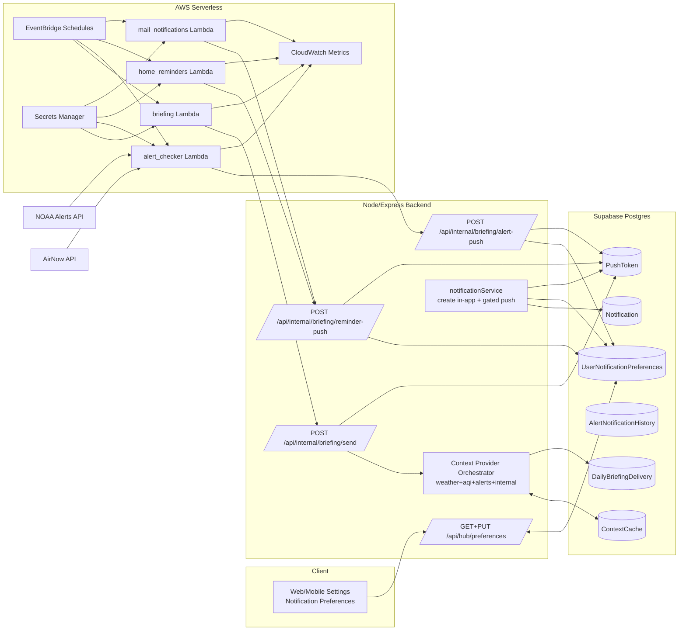
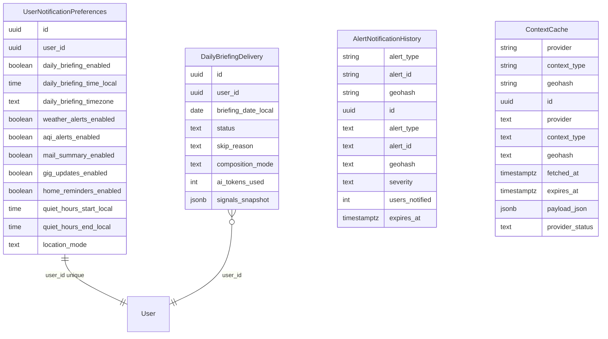
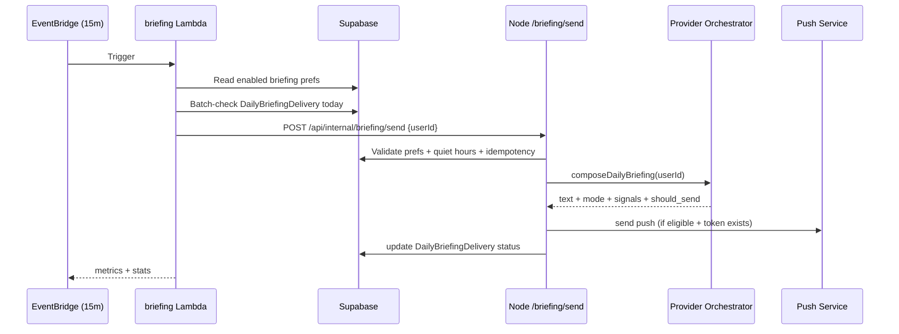
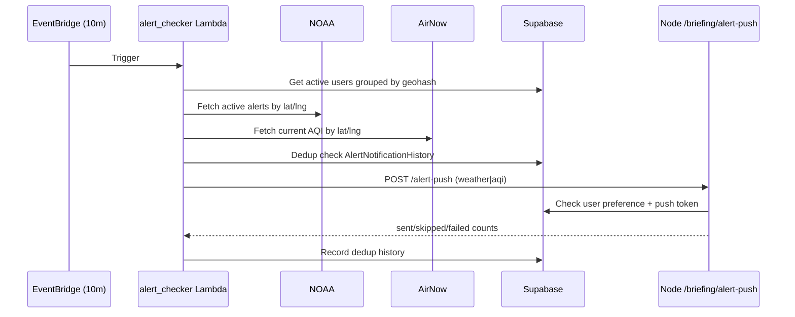

# Pantopus Notification System — Technical Architecture (Branch State as of 2026-04-08)

## 1) Purpose and scope

This document captures the **current built state on this branch** for notification design and implementation, including:

- Daily morning briefing push
- Real-time weather alert pushes (NOAA)
- Real-time AQI spike pushes (AirNow)
- Home bill/task/calendar reminder pushes
- Mail urgent + daily summary pushes
- Gig/home/mail push gating in the existing in-app notification flow
- User-facing preference controls (toggle matrix, quiet hours, briefing schedule, location mode)

It focuses on architecture, data flow, reliability, security, and the technology decisions that are currently implemented.

---

## 2) What is built (feature inventory)

### User preference controls

The system provides per-user controls for:

- `daily_briefing_enabled`
- `weather_alerts_enabled`
- `aqi_alerts_enabled`
- `home_reminders_enabled`
- `gig_updates_enabled`
- `mail_summary_enabled`
- quiet hours (`quiet_hours_start_local`, `quiet_hours_end_local`)
- briefing time and timezone
- location mode (`primary_home`, `viewing_location`, `device_location`, `custom`)

These are surfaced in web settings and persisted via Hub preference APIs.

### Delivery channels

- **In-app notifications** are always created through `Notification` rows.
- **Push delivery** is gated by:
  1. global push enablement (`MailPreferences.push_notifications`), and
  2. granular type-level toggles in `UserNotificationPreferences`.

### Async push pipelines (Lambda → Node internal API)

- **Briefing scheduler Lambda**: every 15 min, timezone-aware user selection, idempotent send.
- **Alert checker Lambda**: every 10 min, NOAA + AirNow checks by geohash, dedup via history table.
- **Home reminders Lambda**: twice daily (morning/evening PT windows), bills/tasks/calendar reminders.
- **Mail notifications Lambda**: every 5 min, urgent interrupts + morning daily summary.

---

## 3) High-level architecture

---

## 4) Core design principles and key decisions

## 4.1 In-app is authoritative; push is optional

The architecture decouples **notification creation** from **push delivery gating**:

- In-app notification rows are still created in the core notification service.
- Push delivery is conditionally sent based on global and type-specific preferences.

Why this was chosen:

- avoids data loss in notification center
- supports “silent inbox” behavior for muted categories
- keeps event auditability even when push is disabled

## 4.2 Dedicated internal briefing/reminder endpoints

Push-capable Lambdas do not directly manage app internals; they call narrow internal endpoints secured by an internal API key.

Why this was chosen:

- keeps business logic centralized in Node backend
- avoids duplicating preference/token logic across Python Lambdas
- allows controlled interface for server-to-server automation

## 4.3 Geohash dedup for environmental alerts

The alert checker groups users by geohash and tracks sent alerts in `AlertNotificationHistory` keyed by `(alert_type, alert_id, geohash)`.

Why this was chosen:

- prevents repeated pushes for same alert in same area
- reduces NOAA/AirNow request fan-out
- still allows geographic specificity

## 4.4 Template-first briefing composition with optional AI polish

Briefings are deterministic first, with optional AI “finisher” for richer multi-signal days, validated and fallback-safe.

Why this was chosen:

- predictable baseline and bounded risk
- lower latency/cost for common paths
- graceful degradation if model/service unavailable

---

## 5) Data model architecture

---

## 6) End-to-end flow diagrams

### 6.1 Daily briefing flow

### 6.2 Real-time weather/AQI alert flow

---

## 7) Component-by-component design

### 7.1 Node backend (Express)

- Internal routing order explicitly mounts `/api/internal/briefing` before generic internal routes.
- Internal endpoints require `x-internal-api-key` matching server env.
- `/send` performs strict sequence: validate user, check prefs, quiet hours, idempotency row insert, compose, token check, send, persist final state.
- `/alert-push` and `/reminder-push` both apply preference + token checks before delivery.

### 7.2 Context orchestration and composition

- Location resolved first, then weather/AQI/alerts/internal context fetched concurrently via `Promise.allSettled`.
- Outputs include provider usage, cache-hit counters, partial failure tracking.
- Daily briefing send threshold: skip only when low-signal **and** no weather context.
- Composer strategy:
  - deterministic templates for baseline
  - optional OpenAI polish for 3+ signal days
  - validation + fallback to template

### 7.3 Notification service behavior for existing app events

- Type groups (`GIG_TYPES`, `HOME_TYPES`, `MAIL_TYPES`) map to preference fields.
- Unknown/unmapped types default to enabled (non-breaking behavior).
- Push is non-blocking and does not block in-app notification persistence.

### 7.4 Serverless pipelines (Python Lambdas)

- All handlers use shared secrets bootstrap for Supabase service role + internal API key.
- CloudWatch metrics per domain namespace:
  - `Pantopus/Briefing/{env}`
  - `Pantopus/Alerts/{env}`
  - `Pantopus/Reminders/{env}`
  - `Pantopus/MailNotifications/{env}`
- Alert/reminder/mail dedup uses `AlertNotificationHistory` with controlled expiration windows.

### 7.5 Frontend notification settings

- Web settings page provides full toggle matrix and quiet-hours UX.
- Debounced autosave (`~600ms`) to reduce update chatter.
- Uses strongly typed shared interface `UserNotificationPreferences`.

---

## 8) Technology choices and rationale

| Technology | Where used | Why it was chosen |
|---|---|---|
| Node.js + Express | Core API/internal delivery endpoints | Existing service core, low-latency routing, central business logic |
| Supabase (Postgres + RLS + service role) | Preference tables, delivery logs, dedup history, tokens | Strong relational model + policy controls + easy service-role access for jobs |
| AWS Lambda (Python) | Scheduler/checker/reminder jobs | Event-driven elasticity, isolated job concerns, low ops overhead |
| EventBridge schedules | Triggering periodic jobs | Native, reliable cron/rate scheduling with straightforward IaC wiring |
| CloudWatch metrics | Operational visibility | Native AWS observability for per-job success/failure/latency KPIs |
| NOAA API | Weather alert source | Authoritative U.S. weather alert feed |
| AirNow API | AQI source | Standardized air quality signal source |
| OpenAI model (optional) | Briefing language polish | Better fluency on dense multi-signal days with deterministic fallback |
| Geohash bucketing | Alert fan-out and dedup scope | Efficient location clustering and anti-spam dedup semantics |

---

## 9) Reliability, scalability, and failure handling

### Reliability patterns implemented

- Idempotent briefing sends via unique `(user_id, briefing_date_local)` constraint.
- Explicit skip reasons (`opted_out`, `quiet_hours`, `already_processed`, `no_push_token`, etc.).
- `Promise.allSettled` around provider fan-out to tolerate partial provider failures.
- Alert/reminder/mail dedup persistence to avoid repeated nudges.
- Non-blocking push in notification service to prevent user-flow failure propagation.

### Scalability controls in code

- Briefing scheduler hard cap per invocation (`MAX_USERS_PER_RUN = 100`).
- `/alert-push` target array capped to 100 users per call.
- Geohash grouping reduces external API calls from O(users) to O(areas).

### Known branch-level tradeoffs

- Several loops perform sequential per-user checks; functional but may require batching when volume scales.
- Current dedup model is strong per geohash/day-bucket, but could still send repeated messages across threshold buckets by design (intentional for changing AQI severity).

---

## 10) Security and privacy architecture

- Internal automation endpoints guarded by `INTERNAL_API_KEY` header validation.
- Service role policies explicitly granted for automation tables.
- User-facing preference data remains protected by RLS policies scoped to `auth.uid()`.
- Secrets sourced from AWS Secrets Manager in deployed Lambda topology.

---

## 11) API contract summary

- `GET /api/hub/preferences` → fetch existing or default preference model
- `PUT /api/hub/preferences` → partial upsert with schema validation
- `POST /api/internal/briefing/send` → per-user briefing compose + deliver
- `POST /api/internal/briefing/alert-push` → bulk weather/AQI push fan-out (with gating)
- `POST /api/internal/briefing/reminder-push` → single-user reminder/mail push (with gating + quiet hours)

---

## 12) Operational schedules (as deployed in SAM template)

- Briefing scheduler: `rate(15 minutes)`
- Alert checker: `rate(10 minutes)`
- Home reminders: `cron(0 14 * * ? *)` and `cron(0 1 * * ? *)` (morning/evening PT)
- Mail notifications: `rate(5 minutes)`
- Briefing cleanup: `rate(1 day)`

---

## 13) Recommended next architecture iterations

1. **Batch preference/token reads** in internal push endpoints to reduce per-user DB round-trips.
2. **Queue-based fan-out option** (SQS/SNS) for large alert cohorts beyond 100-user chunking.
3. **Unified delivery event table** for push attempt telemetry (provider response codes, retry metadata).
4. **Per-toggle analytics dashboard** (opt-out rate, suppressed-by-quiet-hours, send-to-open funnel).
5. **Regionalized scheduler windows** beyond PT-centric assumptions in reminder/mail pipelines.

---

## 14) Appendix — branch implementation pointers

Primary implementation areas used for this architecture:

- Supabase migrations for notification prefs, delivery log/cache, and dedup history
- Node routes/services for preference APIs, internal push endpoints, orchestrator, composer, and type gating
- Python Lambda handlers and SAM template for scheduling, secrets, metrics, and event cadence
- Frontend notification settings UI and shared types

