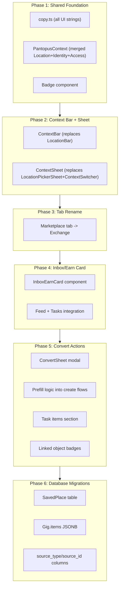

# Pantopus 3 Signature Moves Implementation Plan

> **Historical context:** Written while the mobile client was React Native at `frontend/apps/mobile/`. That app has been replaced by native iOS ([`frontend/apps/ios`](../frontend/apps/ios)) and Android ([`frontend/apps/android`](../frontend/apps/android)). Paths like `frontend/apps/mobile/src/...` in this plan map to the corresponding Swift/Kotlin modules; see the root README "Migration notes (from React Native)" section.

## Architecture Overview




---

## Phase 1: Shared Foundation

### 1a. Copy strings file

- Create `[frontend/apps/mobile/src/constants/copy.ts](frontend/apps/mobile/src/constants/copy.ts)`
- Contains ALL UI strings from the spec: Context Bar formats, Context Sheet sections, Inbox/Earn card, empty states, permission states, badge strings, etc.
- Exported as typed constants so every component pulls from one source

### 1b. PantopusContext (unified context)

- Create `[frontend/apps/mobile/src/contexts/PantopusContext.tsx](frontend/apps/mobile/src/contexts/PantopusContext.tsx)`
- **Merges** the existing `[LocationContext.tsx](frontend/apps/mobile/src/contexts/LocationContext.tsx)` and `[IdentityContext.tsx](frontend/apps/mobile/src/contexts/IdentityContext.tsx)` into one provider
- Adds **access computation** (derived state, not stored):
  - `accessLevel`: computed from `placeType` + user's home memberships + GPS distance
  - `canPost`, `canComment`, `canSeeMailbox`, `canSeeHouseholdCounts`: derived booleans
- Adds **saved places** state (loaded from API, CRUD operations)
- State shape matches the spec's "Context object":
  - `place`: { placeType, placeId, label, centerLatLng }
  - `radius`: { radiusMode, radiusMiles }
  - `viewingAs`: { actorType, actorId } (replaces IdentityContext's mode/activeHome/activeBusiness)
  - `access`: { accessLevel, canPost, canComment, canSeeMailbox, canSeeHouseholdCounts }
- Persists to AsyncStorage (same pattern as current LocationContext)
- Existing `LocationContext` and `IdentityContext` are **kept as thin wrappers** initially (re-exporting from PantopusContext) to avoid breaking every import at once. We migrate screens to use `usePantopus()` directly.

### 1c. Badge component

- Create `[frontend/apps/mobile/src/components/Badge.tsx](frontend/apps/mobile/src/components/Badge.tsx)`
- Small chip component: `<Badge type="verified_resident" />`, `<Badge type="home_admin" />`, etc.
- Used on post cards, task cards, listing cards, profile header, Context Sheet

### 1d. Access utility

- Create `[frontend/apps/mobile/src/utils/access.ts](frontend/apps/mobile/src/utils/access.ts)`
- Pure functions: `computeAccessLevel(place, userHomes, gpsCoords)` -> accessLevel
- `getPermissions(accessLevel, actorType)` -> { canPost, canComment, canSeeMailbox, ... }
- GPS distance check: haversine formula for "nearby" determination (client-side MVP)

---

## Phase 2: Context Bar + Context Sheet

### 2a. ContextBar component

- Create `[frontend/apps/mobile/src/components/ContextBar.tsx](frontend/apps/mobile/src/components/ContextBar.tsx)` (replaces `[LocationBar.tsx](frontend/apps/mobile/src/components/LocationBar.tsx)`)
- Pill row layout:
  - Left: location pin icon
  - Primary: `place.label`
  - Inline chips: "Viewing as {actorType}", role chip if home/business, optional household count, inbox badge
- Format strings pulled from `copy.ts`
- Tap opens Context Sheet
- Reads from `usePantopus()` hook

### 2b. ContextSheet component

- Create `[frontend/apps/mobile/src/components/ContextSheet.tsx](frontend/apps/mobile/src/components/ContextSheet.tsx)` (replaces both `[LocationPickerSheet.tsx](frontend/apps/mobile/src/components/LocationPickerSheet.tsx)` and `[ContextSwitcher.tsx](frontend/apps/mobile/src/components/ContextSwitcher.tsx)`)
- Bottom sheet modal with 5 sections from spec:
  - **Section A: Place** - Current location, My home (with home picker), Search a place, Saved places
  - **Section B: Viewing As** - Personal / Home / Business radio options with role chips
  - **Section C: Access and Trust** - Read-only display of Verified/Nearby/Visitor status + rule text
  - **Section D: Radius** - Auto / 1mi / 3mi / 10mi / 25mi chips
  - **Section E: Actions** - Manage homes/businesses/saved places, Location settings
- Includes all empty/error states from spec (no homes, multiple homes, location permission states)
- Reuses search logic from current `LocationPickerSheet`

### 2c. Screen integration

- Update `[(tabs)/index.tsx](frontend/apps/mobile/src/app/(tabs)`/index.tsx) (Feed): replace `<LocationBar />` with `<ContextBar />`
- Update `[(tabs)/marketplace.tsx](frontend/apps/mobile/src/app/(tabs)`/marketplace.tsx): replace `<LocationBar />`
- Update `[(tabs)/gigs.tsx](frontend/apps/mobile/src/app/(tabs)`/gigs.tsx): replace `<LocationBar />`
- Update `[_layout.tsx](frontend/apps/mobile/src/app/_layout.tsx)`: replace `LocationPickerSheet` with `ContextSheet`, replace provider hierarchy
- Add posting restriction modal (shown when user taps Create but `canPost` is false)

---

## Phase 3: Tab Rename

- Update `[(tabs)/_layout.tsx](frontend/apps/mobile/src/app/(tabs)`/_layout.tsx): rename `marketplace` tab title from "Market" to "Exchange", update icon
- Update marketplace screen header text to "Exchange" with subtitle "Buy, sell, give, hire, deliver"
- All other references to "Marketplace" in the app updated to "Exchange"

---

## Phase 4: Inbox/Earn Card

### 4a. InboxEarnCard component

- Create `[frontend/apps/mobile/src/components/InboxEarnCard.tsx](frontend/apps/mobile/src/components/InboxEarnCard.tsx)`
- Card with:
  - Title row: "Inbox" + badge count
  - Summary line: "{billCount} bill . {offerCount} offer"
  - Earn row: "Earn today" with offer count
  - Actions: "Open inbox" (primary), "View offers" (secondary)
- Content varies by `viewingAs`:
  - Personal: personal inbox + offers
  - Home: home mailbox (gated to members)
  - Business: business inbox (future, hide Earn)
- Locked state when viewing as Home without access: explainer + "Switch to Personal" / "Request access"
- Data comes from existing mailbox API (`api.mailbox.getMailbox`) + notifications API

### 4b. Screen integration

- Add `<InboxEarnCard />` at the top of Feed screen (above post type filters)
- Add `<InboxEarnCard />` at the top of Tasks screen (above filter bar)
- Card refreshes when `viewingAs` changes

---

## Phase 5: Convert Actions (Missions)

### 5a. ConvertSheet modal

- Create `[frontend/apps/mobile/src/components/ConvertSheet.tsx](frontend/apps/mobile/src/components/ConvertSheet.tsx)`
- Bottom sheet triggered from overflow menu (three dots) on cards
- Options vary by source type:
  - **Listing**: "Request pickup help", "Need delivery?"
  - **Task**: "Add item details", "Turn into listing"
  - **Post/Event**: "Need volunteers?", "Offer help"
- Each option navigates to appropriate create screen with prefill params

### 5b. Prefill mechanism

- Use Expo Router params to pass prefill data: `router.push({ pathname: '/gig/new', params: { prefill: JSON.stringify(data) } })`
- Update `[gig/new.tsx](frontend/apps/mobile/src/app/gig/new.tsx)`: read `prefill` param, populate fields, show "Prefilled from: {source}" banner
- Update marketplace create modal: same pattern for "Turn into listing"
- Prefill carries: title, description (modified), photos, location, price hints

### 5c. Task items feature ("Add item details")

- Add optional "Items" section to create task screen (`[gig/new.tsx](frontend/apps/mobile/src/app/gig/new.tsx)`)
- Fields: item name, notes, budget cap, preferred store
- Stored as JSONB in Gig.items column (new)
- Task cards show "Items included" badge when items present
- Task detail shows item list

### 5d. Linked object badges

- On task cards: show "Linked to Listing: {title}" chip if `ref_listing_id` is set
- On listing detail: show "Linked Task" chip if a task references it
- Tap chip navigates to linked object
- "Converted from" banner on detail screens when source link exists

### 5e. Mission states on task cards

- Add status chips: Open, Assigned, In Progress, Completed (these likely exist in some form already on the task detail -- extend to cards)

---

## Phase 6: Database Migrations (SQL for Supabase)

These are the SQL statements you'll run manually:

### 6a. SavedPlace table

```sql
CREATE TABLE IF NOT EXISTS "public"."SavedPlace" (
  "id" uuid DEFAULT gen_random_uuid() NOT NULL PRIMARY KEY,
  "user_id" uuid NOT NULL REFERENCES "public"."User"("id") ON DELETE CASCADE,
  "label" text NOT NULL,
  "place_type" text NOT NULL DEFAULT 'searched',
  "latitude" double precision NOT NULL,
  "longitude" double precision NOT NULL,
  "city" text,
  "state" text,
  "source_id" uuid,
  "created_at" timestamptz DEFAULT now(),
  UNIQUE("user_id", "latitude", "longitude")
);
ALTER TABLE "public"."SavedPlace" ENABLE ROW LEVEL SECURITY;
CREATE POLICY "Users can manage own saved places" ON "public"."SavedPlace"
  FOR ALL USING (auth.uid() = user_id);
```

### 6b. Gig table additions

```sql
ALTER TABLE "public"."Gig"
  ADD COLUMN IF NOT EXISTS "items" jsonb DEFAULT '[]'::jsonb,
  ADD COLUMN IF NOT EXISTS "source_type" text,
  ADD COLUMN IF NOT EXISTS "source_id" uuid,
  ADD COLUMN IF NOT EXISTS "ref_post_id" uuid;

COMMENT ON COLUMN "public"."Gig"."items" IS 'Optional item details for errand/pickup tasks';
COMMENT ON COLUMN "public"."Gig"."source_type" IS 'Type of source object: listing, post, event';
COMMENT ON COLUMN "public"."Gig"."source_id" IS 'ID of the source object this task was created from';

ALTER TABLE "public"."Gig"
  ADD CONSTRAINT "gig_source_type_check"
  CHECK (source_type IS NULL OR source_type IN ('listing', 'post', 'event'));
```

### 6c. Listing source columns

```sql
ALTER TABLE "public"."Listing"
  ADD COLUMN IF NOT EXISTS "source_type" text,
  ADD COLUMN IF NOT EXISTS "source_id" uuid;

ALTER TABLE "public"."Listing"
  ADD CONSTRAINT "listing_source_type_check"
  CHECK (source_type IS NULL OR source_type IN ('gig', 'post'));
```

---

## Backend Changes (Minimal)

- **Saved Places endpoints** (new route file `[backend/routes/savedPlaces.js](backend/routes/savedPlaces.js)`):
  - `GET /api/saved-places` - List user's saved places
  - `POST /api/saved-places` - Add a saved place
  - `DELETE /api/saved-places/:id` - Remove a saved place
- **Gig routes** (`[backend/routes/gigs.js](backend/routes/gigs.js)`):
  - Update create/update to accept `items`, `source_type`, `source_id` fields
  - Update GET to return linked listing/post data
- **Listing routes** (`[backend/routes/listings.js](backend/routes/listings.js)`):
  - Update create to accept `source_type`, `source_id`
  - Update GET to return linked gig count
- **Mailbox routes** (`[backend/routes/mailbox.js](backend/routes/mailbox.js)`):
  - Add `GET /api/mailbox/summary` endpoint returning counts by type (bills, notices, offers) for InboxEarnCard
- **API package** (`[frontend/packages/api/src/](frontend/packages/api/src/)`):
  - Add `savedPlaces` endpoint module
  - Add `mailbox.getSummary()` method
  - Update `gigs.createGigV2()` to accept items/source fields

---

## Execution Order

Each phase is independently deployable and testable. Phase 1 is the foundation everything else depends on. Phases 2-5 can technically be done in any order after Phase 1, but the suggested order gives the best incremental experience. Phase 6 (DB migrations) should be run before Phase 5 since convert actions need the new columns.

**Recommended sequence**: Phase 6 (DB) -> Phase 1 (Foundation) -> Phase 2 (Context Bar) -> Phase 3 (Tab rename) -> Phase 4 (Inbox/Earn) -> Phase 5 (Conversions)